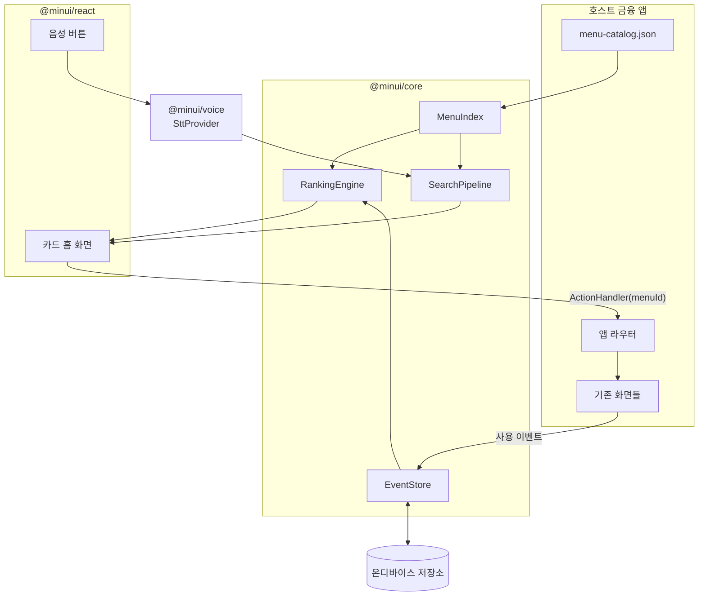
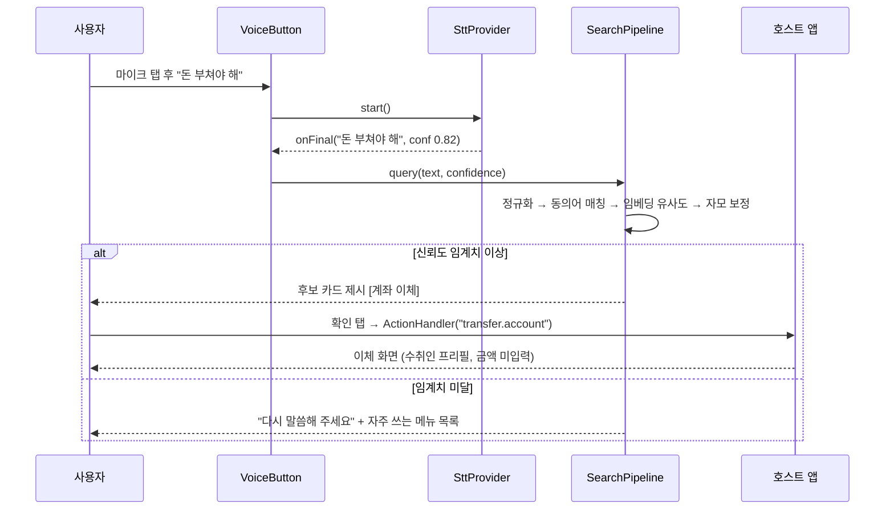

# MinUI Engine — 개인화 미니멀 금융 UI 엔진

> 자주 쓰는 기능만 큰 카드로 남기고, 나머지 메뉴는 음성으로 불러내는 **이식형 UI 레이어**.
> 어떤 금융 앱에도 얹을 수 있게 설계하고, 이체 기능을 갖춘 데모 은행 앱 위에서 검증한다.

| | |
|---|---|
| **문서 종류** | 개인 프로젝트 기획안 (포트폴리오) |
| **작성일** | 2026-08-09 |
| **프로젝트명** | MinUI Engine (제품 컨셉명: "쉬운 모드 플러스")[^1] |
| **범위** | 이식형 UI 엔진 패키지 + 검증용 데모 은행 앱 |
| **기술 스택** | TypeScript (엔진) / React (프런트) / Spring Boot · JPA (데모 계정계) |

[^1]: 네이밍 후보 — MinUI(미니멀 UI 축약, 개발자 대상), 이지탭(EasyTap, 사용자 대상), 큰카드(순우리말 방향). 본 문서는 엔진 이름으로 MinUI를 사용한다.

---

## 1. 개요

**한 줄 요약**: 사용자가 UI에 적응하는 대신, UI가 사용자에게 적응하게 만드는 금융 앱용 UI 엔진.

MinUI Engine은 호스트 금융 앱의 메뉴 구조를 그대로 둔 채 그 위에 얹히는 대체 홈 화면이다. 세 가지 일을 한다.

1. 사용자가 실제로 쓴 메뉴를 온디바이스에 기록한다.
2. 빈도·최신성·상황을 반영해 **상위 4~6개만** 큰 카드로 띄운다.
3. 나머지 전체 메뉴는 화면에서 감추되, **음성 한마디나 검색어 한 줄로 즉시 불러낼 수 있게** 한다.

호스트 앱은 메뉴 목록(JSON)과 메뉴 ID를 받아 화면을 여는 함수, 이 두 가지만 제공하면 된다. 앱 내부 코드를 고칠 필요가 없어 은행 앱·증권 앱·키오스크 어디에나 같은 엔진을 이식할 수 있다.

---

## 2. 문제 정의

### 2.1 문제의 구조

**세대별 IT 수용력은 크게 다른데, 금융 서비스는 모두에게 동일한 인터페이스를 제공한다.** 이 불일치가 문제의 본질이다.

젊은 사용자에게 키오스크의 메뉴 20개는 "선택지"지만, 고령 사용자에게는 "장애물"이다. 증권 앱도 마찬가지다. 기능을 많이 넣을수록 숙련 사용자에게는 강력해지고 비숙련 사용자에게는 불가해해진다. 그런데 두 집단이 **같은 화면**을 본다.

### 2.2 실패는 어디서 일어나는가

주목할 점은 실패 지점이 **기능 수행**이 아니라 **기능 탐색**이라는 것이다.

고령 사용자도 "이체하기" 화면에 도달하면 계좌번호를 입력하고 금액을 넣는 일은 해낸다. 막히는 곳은 그 화면까지 가는 길이다. 홈 → 전체메뉴 → 이체/출금 → 계좌이체처럼 3~4단계를 지나는 동안, 매 단계에서 "다음에 뭘 눌러야 하지"를 판단해야 한다. 판단이 누적될수록 실수와 포기가 늘어난다.

> **설계 함의**: 기능을 쉽게 만드는 것보다 **기능에 도달하는 경로를 없애는 것**이 효과가 크다.

### 2.3 문제를 발견한 계기

할아버지 태블릿을 세팅해 드린 경험이 출발점이다. 안 쓰는 앱을 지우고, 아이콘을 키우고, 홈 화면에 실제로 쓰시는 4개만 남겼더니 그 뒤로 전화 문의가 눈에 띄게 줄었다. 기능을 추가한 게 아니라 **빼기만 했는데** 사용성이 올라갔다.

그런데 이 작업은 내가 손으로 했다. 가족 중에 IT를 아는 사람이 없으면 못 받는 서비스다. 그리고 태블릿 홈 화면은 정리할 수 있어도, **은행 앱 안쪽 메뉴는 사용자가 정리할 방법이 없다.** 이 프로젝트는 그때 손으로 한 일을 앱이 스스로 하게 만드는 것이다.

---

## 3. 기존 해결책과 그 한계

국내 금융 앱 상당수는 이미 "간편 모드", "큰 글씨 모드", "시니어 모드"를 제공한다. 그럼에도 문제가 남아 있는 이유는 두 가지다.

### 한계 1 — 고정 메뉴 세트다

간편 모드가 보여주는 6~8개 메뉴는 **서비스 기획자가 미리 정해 둔 것**이다. 모든 사용자에게 같은 세트가 나간다. 하지만 실제 사용 패턴은 사람마다 다르다. 매달 관리비를 이체하는 사용자, 연금 입금만 확인하는 사용자, 자녀에게 용돈을 보내는 사용자에게 필요한 첫 화면은 서로 다르다. 고정 세트는 이 중 누구에게도 정확히 맞지 않는다.

### 한계 2 — 세트 밖으로 나가면 원점이다

간편 모드에 없는 기능(예: 자동이체 해지, 한도 변경)이 필요해지는 순간, 사용자는 "전체 메뉴로 돌아가기"를 눌러 원래의 복잡한 화면과 다시 마주한다. **간편 모드는 탐색 문제를 해결한 게 아니라 미뤄 둔 것이다.**

### 그래서 두 축이 동시에 필요하다

| 축 | 해결하는 것 | 없으면 생기는 일 |
|---|---|---|
| **개인화** | 첫 화면이 그 사람에게 맞음 | 고정 세트 — 누구에게도 안 맞음 |
| **탐색 대체** | 세트 밖 기능도 한 번에 도달 | 결국 복잡한 메뉴로 회귀 |

기존 간편 모드는 둘 다 없다. MinUI Engine은 개인화(사용 기록 기반 랭킹)와 탐색 대체(음성·검색)를 한 세트로 묶어 이 공백을 메운다.

---

## 4. 솔루션 개요와 설계 원칙

### 4.1 동작 방식

```
[사용자] --사용 기록--> [MinUI Engine] --상위 N개--> [큰 카드 홈 화면]
                              |
   "관리비 내야 하는데" --음성--> [메뉴 검색] --> [해당 화면으로 직행]
```

홈 화면에는 큰 카드 4~6개만 있다. 카드에 없는 기능은 화면 하단 **하나의 음성 버튼**으로 부른다. 사용자는 메뉴 이름을 정확히 몰라도 된다 — "돈 부쳐야 해"라고 말하면 이체 화면이 열린다.

### 4.2 설계 원칙

**P1. 보이는 것은 적게.** 홈에 노출되는 항목은 기본 4개, 최대 6개. 스크롤 없이 한 화면에 들어와야 한다. 카드 하나의 터치 영역은 최소 88×88dp 이상.

**P2. 감추는 게 아니라 불러내는 것.** 전체 메뉴 접근성은 100% 유지한다. 화면에서 사라진 기능도 음성·검색·"전체 메뉴" 진입으로 언제든 도달 가능하다. 기능을 못 쓰게 만드는 축소는 이 프로젝트의 목적이 아니다.

**P3. 화면은 예측 가능해야 한다.** 이것이 순진한 개인화와 갈리는 지점이다. 사용 기록에 따라 카드가 **매번 재배치되면 고령 사용자에게는 오히려 더 나쁘다.** "어제 왼쪽 위에 있던 게 오늘 없다"는 상황은 학습된 근육 기억을 무너뜨린다. 개인화는 하되 변화는 억제해야 한다(§6 F3, §8.2).

**P4. 호스트 앱을 수정하지 않는다.** 엔진은 호스트 앱의 라우팅·상태·인증에 관여하지 않는다. 메뉴 카탈로그와 액션 핸들러만 주입받는다. 이식 비용이 낮아야 "어떤 금융 앱에도 적용 가능"이 말이 된다.

> **왜 이 원칙 조합인가 / 무엇을 포기했는가**
> P1·P3을 함께 지키려면 "가장 최신 사용 패턴을 즉각 반영하는 반응성"을 포기해야 한다. 추천 시스템 관점에서는 손해지만, 고령 사용자 대상 UI에서는 **일관성이 정확도보다 중요하다**고 판단했다.

---

## 5. 타깃 사용자와 시나리오

### 5.1 페르소나

**페르소나 A — 김순자 (73세, 연금 수령자)**
- 스마트폰 보유, 카카오톡과 전화 위주 사용. 은행 앱은 설치되어 있으나 월 1~2회만 사용
- 실제로 쓰는 기능: 잔액 확인, 관리비 이체(같은 계좌 반복), 연금 입금 확인
- 문제: 앱을 열면 상품 배너와 메뉴가 가득해 어디를 눌러야 할지 모름. 결국 지점 방문
- MinUI 적용 후: 홈에 [잔액 보기] [관리비 보내기] [입금 내역] [전화 상담] 4개 카드

**페르소나 B — 박현우 (46세, 저빈도 증권 앱 사용자)**
- IT 사용에 문제없으나 증권 앱은 분기 1회 수준 사용
- 실제로 쓰는 기능: 보유 종목 확인, 배당 내역 조회
- 문제: 메뉴가 너무 많아 원하는 화면을 매번 새로 찾음. "분명 있는데 어디 있는지 모르겠다"
- MinUI 적용 후: 카드 3개 + 음성으로 "배당금 언제 들어와" → 배당 내역 화면 직행

> 페르소나 B가 중요한 이유: 이 문제는 **고령층만의 문제가 아니다.** 저빈도 사용자 전체가 같은 벽에 부딪힌다. 타깃을 고령층으로만 좁히면 시장과 효용을 스스로 줄이게 된다.

### 5.2 대표 시나리오

**S1. 반복 이체 (개인화 경로)**
매달 25일 관리비를 이체해 온 사용자가 앱을 연다 → 홈 첫 카드가 [관리비 보내기](수취인 프리필) → 탭 1회로 이체 화면 진입 → 금액 확인 후 확정.
*기존: 홈 → 전체메뉴 → 이체 → 계좌이체 → 최근 이체 목록 → 대상 선택 (탭 5회)*

**S2. 잔액 확인 (최단 경로)**
홈 진입 시 첫 카드에 잔액이 이미 표시되어 있음 → **탭 0회**.

**S3. 안 쓰던 기능 찾기 (음성 경로)**
"자동이체 안 나가게 해야 하는데" 발화 → 엔진이 [자동이체 관리] 후보 제시 → 사용자가 확인 탭 → 해당 화면 진입.
*기존: 전체메뉴 → 이체·출금 → 자동이체 → 자동이체 조회/해지 (탭 4회 + 용어 인지 부담)*

---

## 6. 핵심 기능 명세

### F1. 사용 이력 수집

메뉴 진입(`menu_enter`)과 작업 완료(`task_complete`) 이벤트를 기록한다. 저장 항목은 `{메뉴ID, 타임스탬프, 완료여부}` 뿐이다. **금액·계좌번호·수취인 등 거래 내용은 수집하지 않는다.**

- 저장 위치: 온디바이스 (웹 IndexedDB / 모바일 SQLite)
- 보존 기간: 최근 90일 (그 이전은 집계 카운터로만 유지)
- 완료 여부를 함께 기록하는 이유: 들어갔다가 바로 나온 메뉴(=잘못 들어간 메뉴)에 가중치를 주면 안 되기 때문

### F2. 개인화 랭킹

빈도·최신성·상황 세 축의 가중 합으로 메뉴별 점수를 계산해 상위 N개를 뽑는다. 상세 수식은 §8.1.

### F3. 배치 안정화 ★

**이 프로젝트에서 가장 중요한 기능이다.** 랭킹만 있으면 화면이 계속 흔들린다. 세 가지 장치로 억제한다.

| 장치 | 규칙 | 목적 |
|---|---|---|
| **히스테리시스** | 도전 메뉴의 점수가 현재 카드보다 **20% 이상** 높아야 교체 | 근소한 차이로 순서가 뒤집히는 것 방지 |
| **갱신 주기 제한** | 카드 구성 재계산은 **하루 1회**, 앱 미사용 시간대에 반영 | 세션 도중 화면이 바뀌지 않음 |
| **변경 고지** | 카드가 교체되면 새 카드에 "새로 추가됨" 배지를 3일간 표시 | 변화를 사용자가 인지 가능하게 |

추가로 **수동 고정(핀)** 을 지원한다. 사용자나 보호자가 특정 카드를 고정하면 랭킹과 무관하게 위치가 유지된다. 자동화가 실패할 때의 탈출구다.

### F4. 음성/텍스트 메뉴 탐색

발화 또는 텍스트 입력을 받아 메뉴 후보를 제시한다. 파이프라인 상세는 §8.3.

- 입력: 마이크 버튼(홈 하단 고정) 또는 검색창
- 출력: 신뢰도 상위 1~3개 후보를 **큰 버튼으로** 제시. 자동 실행하지 않고 사용자가 고른다
- 인식 실패 시: "다시 말씀해 주세요" + 자주 쓰는 메뉴 목록 표시 (막다른 길을 만들지 않음)

### F5. 콜드 스타트 프로파일

사용 기록이 없는 최초 사용자에게는 랭킹을 계산할 재료가 없다. 온보딩에서 두 가지를 묻고 프리셋 카드 세트를 배치한다.

- 질문 1: 주로 어떤 일로 앱을 여시나요? (조회 중심 / 이체 중심 / 투자 중심)
- 질문 2: 글씨 크기 (보통 / 크게 / 아주 크게)

프리셋은 5~10회 사용 후 실제 기록 기반 랭킹으로 자연스럽게 전환된다. 온보딩을 건너뛰면 "조회 중심" 기본값을 쓴다.

---

## 7. 시스템 아키텍처

### 7.1 패키지 구조

이식성이 이 프로젝트의 핵심 요구사항이므로, 프레임워크 의존성을 가진 코드와 그렇지 않은 코드를 엄격히 분리한다.

```
@minui/core          프레임워크 무관 (순수 TypeScript)
  ├─ EventStore       사용 이력 기록/조회
  ├─ RankingEngine    점수 계산, 히스테리시스 적용
  ├─ MenuIndex        메뉴 카탈로그 + 사전 계산된 임베딩
  └─ SearchPipeline   질의 → 메뉴 후보 매칭

@minui/react         React 바인딩
  ├─ <MinUIHome>      카드 홈 화면
  ├─ <VoiceButton>    음성 입력 트리거
  └─ tokens           글씨 크기/명도 대비/터치 타깃 디자인 토큰

@minui/voice         음성 입력
  └─ SttProvider      인터페이스 + 구현체들 (§9)

호스트 앱 (은행/증권/키오스크)
  ├─ menu-catalog.json   ← 제공해야 할 것 1
  └─ ActionHandler       ← 제공해야 할 것 2
```

`@minui/core`가 React·DOM·브라우저 API에 의존하지 않기 때문에, 나중에 React Native나 다른 프레임워크용 바인딩을 추가할 때 코어를 재작성할 필요가 없다.

### 7.2 이식 계약 (Integration Contract)

호스트 앱이 구현해야 하는 것은 두 개뿐이다.

**① MenuCatalog** — 앱이 가진 메뉴의 목록

```jsonc
{
  "id": "transfer.account",
  "label": "계좌 이체",
  "synonyms": ["돈 보내기", "송금", "부치기", "이체하기"],
  "category": "이체",
  "icon": "transfer",
  "route": "/transfer/account",
  "riskLevel": "high"        // high면 음성으로 실행 불가 (§9.3)
}
```

**② ActionHandler** — 메뉴 ID를 받아 화면을 여는 함수

```ts
type ActionHandler = (menuId: string, params?: Record<string, unknown>) => void;
// 호스트 앱의 라우터를 호출하기만 하면 된다
```

**③ StorageAdapter** (선택) — 기본 구현(IndexedDB)을 쓰지 않을 때만 제공

이 계약이 좁을수록 이식이 쉽다. 인증·세션·API 호출은 전부 호스트 앱 책임으로 남겨 두었다. 엔진은 **"무엇을 보여줄지"만 결정하고 "어떻게 실행할지"는 모른다.**

### 7.3 컴포넌트 관계



### 7.4 음성 탐색 시퀀스



음성이 실행까지 가지 않고 **반드시 사용자 확인 탭을 거친다**는 점에 주목. 근거는 §9.3.

---

## 8. 핵심 알고리즘

### 8.1 랭킹 점수

메뉴 $m$ 의 점수:

```
score(m) = w_f · log(1 + freq(m))          // 빈도 — 많이 쓴 것
         + w_r · exp(-λ · Δt(m))            // 최신성 — 최근에 쓴 것
         + w_c · contextBoost(m)            // 상황 — 지금 쓸 법한 것
         + w_p · isPinned(m)                // 고정 — 사용자가 박아둔 것
```

| 항 | 기본 가중치 | 설명 |
|---|---|---|
| `freq` | `w_f = 1.0` | 로그를 씌워 다빈도 메뉴의 독점 방지. 1일 20번 쓴 메뉴가 20배 점수를 갖지 않게 |
| `recency` | `w_r = 0.6`, `λ = 0.05/일` | 반감기 약 14일. 최근 안 쓰면 서서히 내려감 |
| `context` | `w_c = 0.4` | 시간대·요일·직전 행동 기반 보정. 예: 매달 25일 전후 관리비 이체 |
| `pin` | `w_p = 100` | 사실상 무한대. 고정 카드는 항상 상위 |

`contextBoost`는 규칙 기반으로 시작한다 — 요일/일자 주기성 탐지(같은 메뉴를 매월 비슷한 날에 사용했는가), 시간대 일치도. 학습 모델을 쓰지 않는 이유는 데이터가 사용자 1명분이라 학습이 성립하지 않기 때문이다.

> **왜 이 선택인가 / 무엇을 포기했는가**
> 협업 필터링(비슷한 사용자들이 쓰는 메뉴 추천)을 쓰면 콜드 스타트에 유리하지만, **사용 이력을 서버로 보내야 한다.** 금융 앱에서 개인 사용 패턴을 서버에 쌓는 것은 개인정보 부담과 규제 검토 비용을 크게 키운다. 온디바이스 규칙 기반으로 한정하고, 콜드 스타트는 프리셋(F5)으로 대신 해결했다.

### 8.2 히스테리시스 (배치 안정화)

```
현재 카드 c를 도전자 d가 밀어내려면 두 조건을 모두 만족해야 한다:
  ① score(d) > score(c) × 1.20        (20% 마진)
  ② 마지막 재배치로부터 24시간 경과
```

교체가 확정되면 즉시 반영하지 않고 **다음 앱 실행 시**에 반영한다. 사용 중에 화면이 바뀌는 일을 원천 차단하기 위해서다. 한 번의 재배치에서 교체 가능한 카드는 **최대 1장**으로 제한한다.

> 이 값들(20% / 24시간 / 1장)은 초기 가설이다. §12의 사용자 테스트에서 조정 대상으로 명시해 둔다.

### 8.3 메뉴 검색 파이프라인

```
입력 텍스트
  ↓ ① 정규화        공백/조사 제거, 자모 정규화(NFC)
  ↓ ② 동의어 사전    "돈 부치기/보내기/부쳐" → transfer.account   [정확 매칭, 최우선]
  ↓ ③ 임베딩 유사도  질의 벡터 × 메뉴 벡터 코사인 유사도          [의미 매칭]
  ↓ ④ 자모 보정      음성 오인식 대비, 한글 자모 편집거리          [오류 복구]
  ↓ ⑤ 임계치 판정    최고 점수 < 0.55 → 되묻기
후보 1~3개 출력
```

**② 동의어 사전이 ③ 임베딩보다 앞에 오는 이유**: 금융 도메인의 구어 표현("돈 부치다", "떼간다", "빠져나간다")은 범용 임베딩 모델이 잘 못 잡는다. 도메인 사전으로 확실한 것부터 처리하고, 사전에 없는 표현만 임베딩에 맡긴다. 사전 항목은 메뉴 카탈로그의 `synonyms` 필드로 호스트 앱이 관리한다.

**④ 자모 보정이 필요한 이유**: STT는 고령 사용자 발화에서 오인식률이 올라간다. "이체"를 "이제", "체크"로 받는 식이다. 한글 자모 단위 편집거리로 이런 근접 오류를 복구한다.

**임베딩 처리 방식**: 메뉴 카탈로그는 수백 건 규모라 **빌드 타임에 전부 벡터화해 번들에 포함**한다. 런타임에는 질의 1건만 인코딩하면 되고, 네트워크 호출이 전혀 없다.

> **왜 LLM API가 아닌가 / 무엇을 포기했는가**
> LLM API를 쓰면 "엄마한테 30만원"에서 수취인과 금액까지 추출하는 수준까지 가능하다. 그러나 (a) 발화가 외부로 전송되어 금융권 망분리·개인정보 검토를 통과하기 어렵고, (b) 왕복 지연이 1초를 넘으면 음성 UX가 무너지며, (c) 호출당 비용이 발생하고, (d) 네트워크 불안정 시 기능이 죽는다.
> **포기한 것**: 복잡한 문장에서 파라미터를 추출하는 능력. 대신 "메뉴를 찾아 화면까지 데려다주고, 값 입력은 화면에서 한다"로 범위를 좁혔다. §9.3의 안전 설계와도 방향이 일치한다.

---

## 9. 음성 인식 확장 설계

### 9.1 Provider 추상화

STT는 개발 단계에서 무료 수단으로 검증하고, 상용 도입 시 성능 좋은 유료 엔진으로 교체할 수 있어야 한다. 인터페이스 하나로 격리한다.

```ts
interface SttProvider {
  start(): Promise<void>;
  stop(): void;
  onPartial(cb: (text: string) => void): void;         // 중간 인식 결과
  onFinal(cb: (text: string, confidence: number) => void): void;
  onError(cb: (err: SttError) => void): void;
}
```

| 단계 | 구현체 | 비용 | 용도 |
|---|---|---|---|
| 개발·데모 | 브라우저 Web Speech API | 0 | 프로토타이핑, 데모 시연 |
| 로컬 검증 | whisper.cpp 계열 로컬 모델 | 0 | 오프라인 동작 확인, 인식률 비교 |
| 상용 전환 | 상용 STT API (국내 벤더) | 유료 | 실서비스 품질 |

교체 시 변경되는 코드는 Provider 구현체 파일 하나다. `SearchPipeline` 이상의 상위 코드는 STT가 무엇인지 모른다.

### 9.2 저품질 STT 흡수 장치

무료 STT는 인식률이 낮다. 그 편차를 **엔진 쪽에서 흡수**하도록 설계해, STT를 바꿔도 상위 동작이 일관되게 한다.

- **신뢰도 임계치**: `confidence < 0.5`인 결과는 후보 제시 없이 바로 되묻기
- **부분 인식 활용**: `onPartial`로 받은 중간 결과도 검색에 태워 응답 체감 속도를 높임
- **다중 후보 제시**: 1위 후보만 보여주지 않고 상위 3개까지. 인식이 애매해도 사용자가 고르면 성공
- **되묻기 문구 표준화**: 실패 시 "무엇을 도와드릴까요?" 대신 **"이체, 조회, 내역 중에 찾으시는 게 있나요?"** — 열린 질문보다 선택지 제시가 고령 사용자에게 효과적

### 9.3 안전 경계 — 음성은 어디까지 하는가 ★

**음성은 "메뉴 호출과 화면 프리필"까지만 한다. 이체 실행은 절대 음성으로 완료되지 않는다.**

| 음성으로 가능 | 음성으로 불가 |
|---|---|
| 메뉴 화면 열기 | 이체 실행 |
| 최근 수취인 프리필 | 금액 확정 |
| 조회성 기능 실행 | 인증 통과 |
| | `riskLevel: high` 메뉴의 최종 확정 |

세 가지 이유다.

1. **오인식 리스크**: 금액을 잘못 인식한 이체는 되돌리기 어렵다. 조회는 틀려도 다시 하면 되지만 송금은 아니다.
2. **보이스피싱 표면 확대**: 음성 명령만으로 송금이 완료되는 구조는 옆에서 시키는 대로 말하게 하는 공격에 취약하다. 고령 사용자가 주 타깃인 만큼 이 리스크는 특히 무겁다.
3. **금융권 도입 현실성**: 음성만으로 자금 이동이 완결되는 기능은 보안 심사를 통과하기 어렵다. 처음부터 통과 가능한 범위로 설계하는 편이 낫다.

> 이것은 기술적 한계가 아니라 **의도적으로 그은 선**이다. "AI가 다 해준다"보다 "AI가 데려다주고 사람이 확인한다"가 금융에서 옳은 자동화 수준이라고 판단했다.

---

## 10. 데모 은행 앱 (검증 베드)

엔진만으로는 효과를 증명할 수 없다. 실제 금융 거래가 도는 앱 위에 얹어야 한다. 동시에 이 데모 앱 자체를 **계정계(원장) 프로젝트로도 확장 가능**하게 만든다.

### 10.1 백엔드 — Spring Boot + JPA

최소 계정계 구현. 목표는 기능 개수가 아니라 **금융 거래 처리의 정확성**을 보여주는 것이다.

| 영역 | 구현 내용 |
|---|---|
| 계좌 | 계좌 생성/조회, 잔액은 원장 합계로 산출(잔액 컬럼 직접 수정 금지) |
| 원장 | 복식부기 — 이체 1건 = 출금 분개 + 입금 분개, 차변/대변 합 일치 검증 |
| 이체 | 트랜잭션 경계 내 처리, 잔액 부족 검증, 실패 시 전체 롤백 |
| 멱등성 | 요청별 `Idempotency-Key`로 중복 이체 차단 (네트워크 재시도 대응) |
| 동시성 | 계좌 단위 비관적 락 또는 낙관적 락 + 재시도 |
| 이력 | 거래 내역 조회 API (기간·유형 필터) |

> 잔액을 컬럼으로 들고 UPDATE 하지 않고 원장 합계로 산출하는 이유: 실제 계정계의 설계 방식이고, 정합성 검증(감사)이 가능해지기 때문. 성능은 잔액 스냅샷 테이블로 나중에 보완 가능하다.

### 10.2 프런트엔드 — React

같은 앱을 **두 가지 UI로 전환 가능**하게 만든다. 이것이 검증 설계의 핵심이다.

```
[기본 UI 모드]                    [MinUI 모드]
전체 메뉴 트리 (약 25개 메뉴)  ⇄   큰 카드 4개 + 음성 버튼
전형적인 은행 앱 구조              MinUI Engine 적용
```

두 모드는 **동일한 백엔드, 동일한 기능**을 쓴다. 차이는 UI 레이어뿐이다. 따라서 §12의 비교 측정에서 UI 외의 변수가 통제된다.

메뉴 25개는 실제 은행 앱 구조를 참고해 이체·조회·상품·설정·인증 카테고리로 구성한다. 카드 홈에 나타나지 않는 21개 메뉴가 음성 탐색의 검증 대상이 된다.

---

## 11. 보안 · 개인정보 · 접근성

### 11.1 데이터 최소 수집

| 수집함 | 수집 안 함 |
|---|---|
| 메뉴 ID | 계좌번호 |
| 사용 시각 | 금액 |
| 완료 여부 | 수취인 정보 |
| | 음성 원본 |

사용 이력은 **기본적으로 기기 밖으로 나가지 않는다.** 서버 전송이 필요한 경우(예: 기기 변경 시 이관)에도 메뉴 ID와 카운트 수준의 집계만 전송하며, 사용자 동의를 별도로 받는다.

### 11.2 음성 데이터 처리

- 음성 원본은 인식 완료 즉시 폐기. 저장·전송하지 않음
- 마이크는 버튼을 누른 동안만 활성 (상시 대기 웨이크워드 미채용 — 상시 청취는 사용자 신뢰와 규제 양쪽에서 부담이 큼)
- 인식된 텍스트도 검색 처리 후 폐기, 로그에 남기지 않음
- 마이크 활성 상태를 화면에 명확히 표시

### 11.3 접근성

- 터치 타깃 최소 88×88dp (WCAG 권고치를 상회하는 값 적용 — 고령 사용자 손떨림 고려)
- 명도 대비 4.5:1 이상, 큰 텍스트 3:1 이상
- 글씨 크기 3단계 조절 + OS 글꼴 크기 설정 연동
- 모든 카드에 스크린리더 레이블. 아이콘만 있는 버튼 금지 — **아이콘 + 텍스트 병기 필수**
- 애니메이션 최소화, `prefers-reduced-motion` 존중
- 목표 기준: KWCAG(한국형 웹 콘텐츠 접근성 지침) 준수

### 11.4 금융권 도입 시 검토 항목

실제 금융사 적용을 전제할 때 확인이 필요한 사항을 미리 정리해 둔다. (법령 해석은 별도 검토 필요)

- **망분리 환경 적합성**: 온디바이스 임베딩·로컬 STT 구성은 외부 API 호출이 없어 망분리 환경에서 유리
- **외부 전송 없음**: 개인 사용 패턴의 외부 전송이 없어 개인정보 영향평가 부담이 낮음
- **기존 인증 체계 무변경**: 엔진이 인증에 관여하지 않으므로 기존 보안 체계를 건드리지 않음
- **감사 로그**: 엔진은 화면 전환만 유발하고 거래는 호스트 앱이 처리하므로, 기존 거래 감사 로그 체계가 그대로 유효

---

## 12. 성공 지표와 검증 설계

### 12.1 측정 지표

**1차 지표 (핵심 가설 검증)**

| 지표 | 정의 | 목표 |
|---|---|---|
| 태스크 완료 시간 | "관리비 30만원 이체" 지시부터 완료까지 | 기본 UI 대비 **40% 단축** |
| 탭 횟수 | 동일 태스크 수행 중 화면 터치 횟수 | 기본 UI 대비 **50% 감소** |
| 완료율 | 도움 없이 태스크를 끝낸 참가자 비율 | **90% 이상** |
| 오탐색률 | 목표와 무관한 화면에 진입한 횟수 | 태스크당 1회 미만 |

**2차 지표 (기능별 품질)**

| 지표 | 정의 | 목표 |
|---|---|---|
| 카드 적중률 | 홈 카드만으로 목적을 달성한 세션 비율 | 70% 이상 |
| 음성 1회 성공률 | 첫 발화로 올바른 메뉴에 도달한 비율 | 75% 이상 |
| 배치 안정성 | 주당 카드 교체 횟수 | 1회 이하 |

> 목표 수치는 가설이다. 실측 후 달성/미달을 그대로 기록하는 것이 포트폴리오에서 더 가치 있다.

### 12.2 검증 방법

**A. 모드 간 비교 측정 (정량)**
동일 참가자가 기본 UI 모드와 MinUI 모드로 같은 태스크를 수행한다. 순서 효과를 없애기 위해 참가자 절반은 순서를 바꾼다(counterbalancing). 앱에 측정 계측을 내장해 시간·탭 수를 자동 기록한다.

**B. 소규모 사용자 테스트 (정성)**
- 대상: 60대 이상 5명, 40~50대 저빈도 사용자 3명
- 방법: 태스크 3개(S1~S3) 수행 + 발화 사고법(think-aloud) + 사후 인터뷰
- 관찰 항목: 어디서 멈추는가, 어떤 단어로 기능을 부르는가(→ 동의어 사전에 반영), 카드가 바뀐 걸 알아채는가

**C. 음성 인식 벤치마크**
동일 발화 세트(50문장, 구어체 포함)를 각 STT Provider에 태워 인식률·지연·검색 성공률을 비교. Provider 추상화의 실효성을 수치로 확인한다.

> 표본 8명은 통계적 검정력이 없다. 유의성 주장 없이 **관찰된 패턴과 개별 사례**로 보고한다. 과대 해석하지 않는 것이 정확한 태도다.

---

## 13. 개발 로드맵

| 단계 | 내용 | 완료 기준 (DoD) |
|---|---|---|
| **M1** 데모 은행 앱 | Spring Boot 계정계 + React 기본 UI(25개 메뉴) | 이체 API가 복식부기로 기록되고, 멱등성 키로 중복 요청이 차단되며, 동시 이체 테스트를 통과한다 |
| **M2** core 랭킹 | EventStore + RankingEngine + 히스테리시스 | 이벤트를 주입하면 상위 N개가 산출되고, 20% 마진 미만 도전자는 교체를 못 일으킨다 (단위 테스트) |
| **M3** react 카드 UI | 카드 홈 화면 + 디자인 토큰 + 접근성 | 데모 앱에서 모드 토글이 동작하고, 대비/터치 타깃/스크린리더 검사를 통과한다 |
| **M4** 검색·음성 | SearchPipeline + SttProvider(Web Speech) | 25개 메뉴에 대해 구어체 질의 50건 중 75% 이상이 1회 발화로 정확히 매칭된다 |
| **M5** 측정·튜닝 | 계측 내장 + 사용자 테스트 + 파라미터 조정 | §12 지표가 실측되고, 가중치·임계치가 결과에 근거해 조정된다 |

M1~M2, M3~M4는 각각 백엔드/프런트 축이 달라 부분적으로 병행 가능하다. M5는 앞 단계가 모두 끝나야 시작된다.

---

## 14. 리스크와 대응

| 리스크 | 영향 | 대응 |
|---|---|---|
| **개인화가 오히려 혼란을 준다** | 치명적 — 프로젝트 전제가 무너짐 | F3 배치 안정화(히스테리시스·주기 제한·변경 고지·수동 핀). §12-B에서 최우선 검증 항목 |
| **STT 인식률이 고령 발화에서 급락** | 음성 경로 무력화 | §9.2 흡수 장치 + 텍스트 검색을 항상 동등한 대안으로 제공. 음성은 보조 경로이지 유일 경로가 아님 |
| **콜드 스타트 — 초기에 보여줄 게 없음** | 첫인상 악화 | F5 프리셋 프로파일. 온보딩 2문항으로 초기 세트 결정 |
| **메뉴 카탈로그 유지보수 부담** | 호스트 앱 채택 저해 | 앱 라우팅 테이블에서 카탈로그 초안을 생성하는 CLI 제공(로드맵 이후 과제). 동의어는 사용자 검색 로그에서 후보 추출 |
| **온디바이스 임베딩 번들 크기** | 앱 용량 증가로 채택 저해 | 메뉴 수백 건 규모면 벡터 데이터 자체는 작음. 인코더 모델 크기가 관건 — 경량 모델 선정 및 실측을 M4의 확인 항목으로 명시 |
| **데모 앱이 커져 엔진 개발이 밀림** | 일정 지연 | M1의 범위를 이체·조회·원장으로 엄격히 제한. 상품 가입·대출 등은 메뉴만 존재하고 화면은 스텁 |

---

## 15. 확장 방향

**키오스크·ATM 이식.** 문제의 출발점이었던 키오스크가 오히려 좋은 확장 대상이다. 다만 기기를 여러 사람이 공유하므로 저장 전략이 달라져야 한다 — 사용 이력을 기기가 아니라 **카드/계좌 인증 결과에 연결**하고, 세션 종료 시 화면 상태를 폐기한다. `StorageAdapter` 교체만으로 대응 가능한 구조다.

**증권 앱 적용.** 은행보다 메뉴 수가 많고(수백 개) 용어가 어렵다(예수금, 미수, 반대매매). 동의어 사전의 가치가 더 커지는 반면, 시세 화면처럼 실시간성이 중요한 영역은 카드화가 맞지 않는다. **어떤 메뉴를 카드로 올릴 수 있는가**의 기준을 카탈로그 메타데이터로 표현하는 확장이 필요하다.

**보호자 원격 설정.** 처음 태블릿을 정리해 드릴 때 그랬듯, 가족이 원격으로 카드를 고정하거나 글씨 크기를 맞춰 드릴 수 있는 기능. 다만 타인이 금융 앱 화면 구성을 바꾸는 것이므로 **본인 동의 절차와 권한 범위 제한**이 전제되어야 한다. 조회성 설정만 허용하고 거래 관련 설정은 제외하는 식의 선 긋기가 필요하다.

---

## 부록 A. 기술적 판단 요약

포트폴리오 관점에서 이 프로젝트의 핵심은 기능 목록이 아니라 아래 판단들이다.

| 판단 | 선택 | 포기한 것 | 이유 |
|---|---|---|---|
| 메뉴 탐색 AI | 온디바이스 임베딩 + 도메인 사전 | 복잡한 문장의 파라미터 추출 | 금융권 망분리 적합, 지연 없음, 비용 0, 오프라인 동작 |
| 개인화 방식 | 온디바이스 규칙 기반 | 협업 필터링의 콜드 스타트 이점 | 사용 패턴의 외부 전송을 피하기 위해 |
| 개인화 반영 속도 | 하루 1회 + 20% 마진 | 최신 패턴 즉시 반영 | 고령 사용자에게는 일관성 > 정확도 |
| 음성 실행 범위 | 메뉴 호출 + 프리필까지 | "말만 하면 송금" 데모 임팩트 | 오인식·보이스피싱 리스크, 보안 심사 통과 가능성 |
| 패키지 구조 | core(무관) / react(바인딩) 분리 | 단일 패키지의 단순함 | 이식성이 이 프로젝트의 존재 이유이므로 |
| 데모 잔액 처리 | 원장 합계 산출 | 조회 성능 | 계정계 정합성 검증 가능성 |

## 부록 B. 용어

| 용어 | 설명 |
|---|---|
| 호스트 앱 | MinUI Engine을 얹는 대상 금융 앱 |
| 메뉴 카탈로그 | 호스트 앱이 제공하는 메뉴 목록 정의(JSON) |
| 카드 | 홈 화면에 노출되는 대형 기능 버튼 |
| 히스테리시스 | 상태 전환에 마진을 두어 잦은 전환을 막는 기법 |
| 계정계 | 계좌·거래 원장을 다루는 금융 핵심 시스템 |
| 멱등성 | 같은 요청을 여러 번 보내도 결과가 한 번과 같은 성질 |
