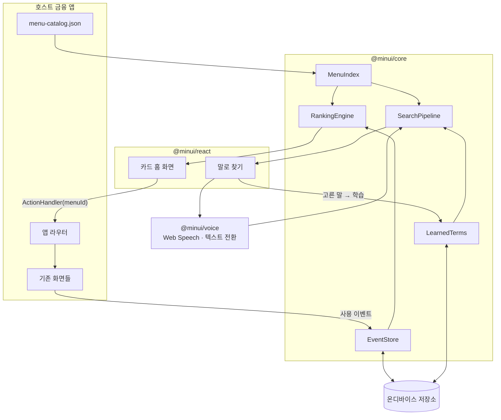
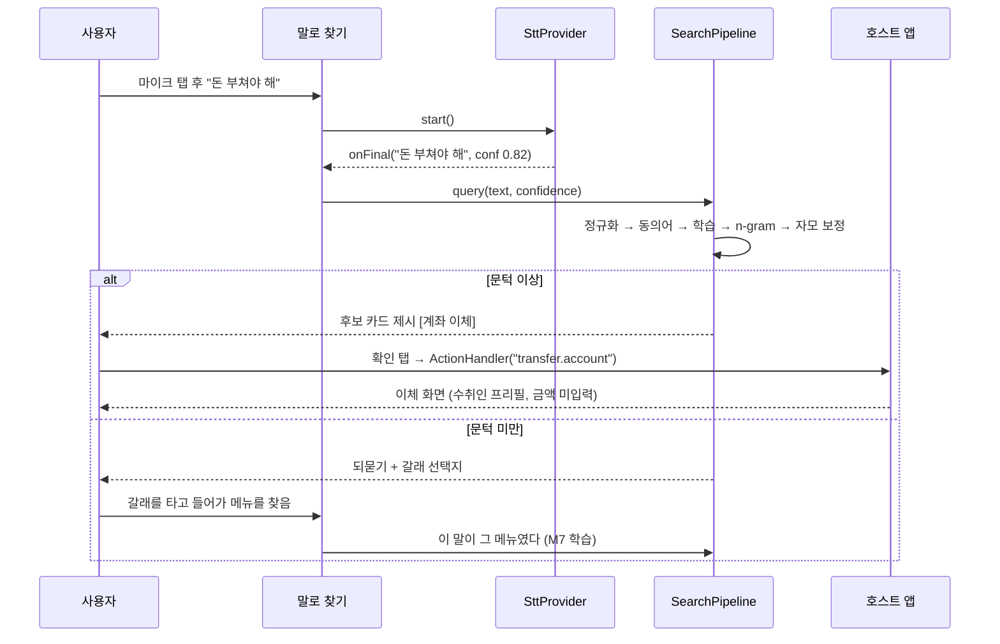

# MinUI Engine — 개인화 미니멀 금융 UI 엔진

> 자주 쓰는 기능만 큰 카드로 남기고, 나머지 메뉴는 음성으로 불러내는 **이식형 UI 레이어**.
> 어떤 금융 앱에도 얹을 수 있게 설계하고, 실제 금융사 5곳과 데모 은행 앱 위에서 검증한다.

| | |
|---|---|
| **문서 종류** | 개인 프로젝트 기획안 + 측정 기록 (포트폴리오) |
| **작성일** | 2026-08-09 |
| **최종 갱신** | 2026-08-26 (M15 가상 오픈뱅킹 시연 · M16 동의형 적응 UI) |
| **범위** | 이식형 UI 엔진 패키지 + 검증용 데모 은행 앱 + 이식 도구(Studio) |
| **기술 스택** | TypeScript (엔진) / React (프런트) / Spring Boot · JPA (데모 계정계) |

> **이 문서 하나가 기획과 결과를 함께 담는다.** 끝난 항목에는 결과를, 진행 중인 항목에는
> 가설·다음 검증·한계를 함께 적는다. 새 사용자 문제나 AI 기술이 더 나은 해법을 열면 방향을
> 확장할 수 있다. 단, 이전 수치를 좋아 보이게 만들기 위해 기준을 바꾸지는 않고 무엇이
> 달라졌는지는 같은 자리에서 비교한다.

---

## 0. 현재 상태

| | |
|---|---|
| 테스트 | 541개 통과 |
| 이식 대상 | 실제 금융사 5곳, 메뉴 2,948개 |
| 자동 수집 회수율 | **99%** (로그인 불필요 4곳) |
| 이식 시간 | 반나절 → **10초** (`/studio`) |
| 검색 — 온디바이스만 / LLM 폴백까지 | 85% / **95%** |
| 검색 — 손대지 않은 2곳 (가장 믿을 만함) | **80%** (24/30) |
| 답 없는 질의 100건 | **97건 옳게 거절** |
| 완료 시간·완료율·오탐색률 | **미측정** — 사람이 있어야 나온다 |
| 가상 오픈뱅킹 · 적응 UI | 구현·자동 테스트 완료, **사용자 효과는 미측정** |

지표별 목표 대비 실측은 §12.1, 근거는 §12 전체, 되돌린 실험은 §16에 있다.

### 모든 수치에 공통된 흠

**질의도 내가 쓰고 동의어도 내가 썼다.** 질의 75건 중 49%가 사람이 붙인 동의어와 문자열로
겹치고 10건은 글자까지 같다. 이 세트는 실제 표현·동의어·n-gram 경로가 퇴행하지 않는지를
보는 회귀 지표로 계속 쓴다. 신경망/LLM의 **추가 의미 회수**는 정답 표현과 겹치지 않는
`semantic-focus` 세트와 제3자·사용자 발화로 따로 판단한다.

그러므로 손대지 않은 두 사이트의 80%는 유용한 비교점이고, 모든 수치를 무효화하는 이유가
아니다. 측정의 한계는 다음 AI 개선이 답해야 할 질문을 정한다.

---

## 1. 개요

**한 줄 요약**: 사용자가 UI에 적응하는 대신, UI가 사용자에게 적응하게 만드는 금융 앱용 UI 엔진.

호스트 금융 앱의 메뉴 구조를 그대로 둔 채 그 위에 얹히는 대체 홈 화면이다. 네 가지를 한다.

1. 사용자가 실제로 쓴 메뉴를 온디바이스에 기록한다.
2. 빈도·최신성·상황을 반영해 **상위 4~6개만** 큰 카드로 띄운다.
3. 나머지 전체 메뉴는 감추되, **음성 한마디나 검색어 한 줄로 즉시 불러낼 수 있게** 한다.
4. 검색이 못 알아들은 말을 사용자가 끝내 찾아내면, **그 말을 그 기기가 기억한다** (M7).

호스트 앱은 메뉴 목록(JSON)과 메뉴 ID를 받아 화면을 여는 함수, 두 가지만 제공하면 된다.

---

## 2. 문제 정의

### 2.1 문제의 구조

**세대별 IT 수용력은 크게 다른데, 금융 서비스는 모두에게 동일한 인터페이스를 제공한다.**
젊은 사용자에게 메뉴 20개는 "선택지"지만, 고령 사용자에게는 "장애물"이다. 기능을 많이
넣을수록 숙련 사용자에게는 강력해지고 비숙련 사용자에게는 불가해해지는데, 두 집단이
**같은 화면**을 본다.

### 2.2 실패는 어디서 일어나는가

실패 지점은 **기능 수행**이 아니라 **기능 탐색**이다. 고령 사용자도 "이체하기" 화면에
도달하면 계좌번호와 금액을 넣는 일은 해낸다. 막히는 곳은 그 화면까지 가는 길이다.
홈 → 전체메뉴 → 이체/출금 → 계좌이체를 지나는 동안 매 단계에서 "다음에 뭘 눌러야 하지"를
판단해야 하고, 판단이 누적될수록 실수와 포기가 늘어난다.

> **설계 함의**: 기능을 쉽게 만드는 것보다 **기능에 도달하는 경로를 없애는 것**이 효과가 크다.

**이 주장은 측정으로 한 번 확인됐다.** §12.4의 탭 측정에서 자주 쓰는 기능(이체·잔액)은
어떤 앱이든 이미 홈에 있어 차이가 0이었고, 차이는 꼬리에서만 났다.

### 2.3 문제를 발견한 계기

할아버지 태블릿을 세팅해 드린 경험이 출발점이다. 안 쓰는 앱을 지우고 아이콘을 키우고
홈에 실제로 쓰시는 4개만 남겼더니 전화 문의가 눈에 띄게 줄었다. 기능을 추가한 게 아니라
**빼기만 했는데** 사용성이 올라갔다.

그런데 그 작업은 내가 손으로 했다. 가족 중에 IT를 아는 사람이 없으면 못 받는 서비스이고,
**은행 앱 안쪽 메뉴는 사용자가 정리할 방법이 아예 없다.** 이 프로젝트는 그때 손으로 한
일을 앱이 스스로 하게 만드는 것이다.

---

## 3. 기존 해결책과 그 한계

국내 금융 앱 상당수가 이미 "간편 모드"를 제공한다. 그럼에도 문제가 남는 이유는 둘이다.

**한계 1 — 고정 메뉴 세트다.** 간편 모드의 6~8개는 서비스 기획자가 미리 정해 둔 것이고
모든 사용자에게 같은 세트가 나간다. 매달 관리비를 이체하는 사용자, 연금 입금만 확인하는
사용자에게 필요한 첫 화면은 서로 다르다.

**한계 2 — 세트 밖으로 나가면 원점이다.** 간편 모드에 없는 기능이 필요해지는 순간
"전체 메뉴로 돌아가기"를 눌러 원래의 복잡한 화면과 다시 마주한다. **간편 모드는 탐색
문제를 해결한 게 아니라 미뤄 둔 것이다.**

| 축 | 해결하는 것 | 없으면 생기는 일 |
|---|---|---|
| **개인화** | 첫 화면이 그 사람에게 맞음 | 고정 세트 — 누구에게도 안 맞음 |
| **탐색 대체** | 세트 밖 기능도 한 번에 도달 | 결국 복잡한 메뉴로 회귀 |

기존 간편 모드는 둘 다 없다. MinUI는 개인화와 탐색 대체를 한 세트로 묶는다.

---

## 4. 설계 원칙

**P1. 보이는 것은 적게.** 홈 노출은 기본 4개, 최대 6개. 스크롤 없이 한 화면. 터치 영역
최소 88×88dp.

**P2. 감추는 게 아니라 불러내는 것.** 전체 메뉴 접근성 100% 유지. 화면에서 사라진 기능도
음성·검색·전체 메뉴로 언제든 도달 가능하다.

**P3. 화면은 예측 가능해야 한다.** 순진한 개인화와 갈리는 지점이다. 카드가 매번 재배치되면
고령 사용자에게는 오히려 더 나쁘다. **개인화는 하되 변화는 억제한다** (§8.2).

**P4. 기본 통합은 가볍게, AI 확장은 선택적으로.** 엔진은 호스트의 라우팅·상태·인증을
소유하지 않아 이식 비용을 낮춘다. 다만 현재 화면, 사용자가 선택한 도움 방식, 공식 안내문처럼
AI 접근성 경험에 필요한 맥락은 선택적 capability로 받을 수 있다. 기존 두 입력만으로도
작동하는 호환성은 유지한다.

> **무엇을 포기했는가**
> P1·P3을 함께 지키려면 "최신 사용 패턴을 즉각 반영하는 반응성"을 포기해야 한다. 추천
> 시스템 관점에서는 손해지만, 고령 사용자 대상 UI에서는 **일관성이 정확도보다 중요하다**고
> 판단했다.

---

## 5. 타깃 사용자와 시나리오

### 5.1 페르소나

**페르소나 A — 김순자 (73세, 연금 수령자).** 은행 앱은 월 1~2회. 쓰는 기능은 잔액 확인,
관리비 이체, 연금 입금 확인. 앱을 열면 배너와 메뉴가 가득해 어디를 눌러야 할지 모른다.

**페르소나 B — 박현우 (46세, 저빈도 증권 앱 사용자).** IT에 문제없으나 분기 1회 사용.
"분명 있는데 어디 있는지 모르겠다."

> B가 중요한 이유: 이 문제는 **고령층만의 문제가 아니다.** 저빈도 사용자 전체가 같은 벽에
> 부딪힌다. 타깃을 고령층으로만 좁히면 시장과 효용을 스스로 줄이게 된다.

### 5.2 대표 시나리오

| | 시나리오 | 경로 |
|---|---|---|
| **S1** | 반복 이체 | 홈 첫 카드 [관리비 보내기] → 탭 1회 |
| **S2** | 잔액 확인 | 첫 카드에 잔액이 이미 표시 → **탭 0회** |
| **S3** | 안 쓰던 기능 찾기 | "자동이체 안 나가게 해야 하는데" → 후보 제시 → 확인 탭 |
| **S4** | 가상 가족 이체 시연 | "삼촌에게 3만원 보내기" → 계좌 이체 후보 탭 → 수취인·금액 확인 → **사람이 보내기** → 가상 원장·잔액 갱신 |

---

## 6. 핵심 기능 명세

### F1. 사용 이력 수집

`menu_enter`와 `task_complete`를 기록한다. 저장 항목은 `{메뉴ID, 시각, 완료여부}`.
**금액·계좌번호·수취인은 수집하지 않는다.**

- 저장 위치: 온디바이스 (웹 IndexedDB)
- 보존 기간: 최근 90일, 그 이전은 집계 카운터로 접는다
- 완료 여부를 함께 남기는 이유: 들어갔다 바로 나온 메뉴(=잘못 들어간 메뉴)에 가중치를
  주면 안 되기 때문

### F2. 개인화 랭킹

빈도·최신성·상황의 가중 합으로 상위 N개를 뽑는다. 수식은 §8.1.

### F3. 배치 안정화 ★

**이 프로젝트에서 가장 중요한 기능이다.** 랭킹만 있으면 화면이 계속 흔들린다.

| 장치 | 규칙 |
|---|---|
| 히스테리시스 | 도전자 점수가 현재 카드보다 **20% 이상** 높아야 교체 |
| 갱신 주기 제한 | 재계산은 하루 1회, 결과는 **다음 세션에** 반영 |
| 1회 1장 | 한 번의 재배치에서 최대 1장 |
| 변경 고지 | 새 카드에 "새로 추가됨" 배지 3일. 배지가 만료돼도 이유는 F8에 남는다 |
| 수동 고정(핀) | 랭킹과 무관하게 자리 유지 — 자동화가 실패할 때의 탈출구 |

카드 **순서**는 자리 유지가 아니라 중요도 순이다 — ① 고정한 것 먼저 ② 조회 횟수 많은 것부터
③ 동률이면 고정 순서 / 최근 본 순서. 점수 하나로 정렬하지 않는 이유는 "왜 이 카드가 위에
있는가"를 사용자에게 설명할 수 없기 때문이다.

### F4. 음성/텍스트 메뉴 탐색

- 입력: 마이크 버튼 또는 검색창
- 출력: 상위 1~3개 후보를 **큰 버튼으로**. 자동 실행하지 않고 사용자가 고른다
- 실패 시: 되묻되 **선택지를 함께 준다.** 막다른 길을 만들지 않는다

### F5. 콜드 스타트

사용 기록이 없으면 랭킹을 계산할 재료가 없다. 카탈로그 앞의 `cardable` 넉 장으로 시작하고,
5~10회 사용 후 실제 기록 기반 랭킹으로 전환된다.

> **온보딩 질문 화면은 만들지 않았다.** 기획 초안은 두 문항(주 용도 / 글씨 크기)을 묻고
> 프로파일별 프리셋을 배치하려 했다. 엔진에는 `ColdStartProfile`이 남아 있지만
> `firstCards()`가 세 부류에 **같은 넉 장**을 주므로 지금 그 답은 화면을 바꾸지 않는다.
> **물어놓고 안 쓰는 것보다 안 묻는 편이 정직하다**고 보아 화면을 만들지 않았다.
> 값을 하는지는 M10에서 물어보고 정한다.

### F6. 개인 동의어 학습 (M7)

검색이 못 알아들은 말로 사용자가 되묻기·갈래를 거쳐 끝내 메뉴에 도달하면, 그 말이
**그 기기에서** 그 메뉴의 이름이 된다. 상세는 §8.4, 측정은 §12.8.

### F7. 어려운 말 풀이 (M6)

메뉴를 **찾는 것**과 그게 **뭔지 아는 것**은 다른 문제다. `예수금`·`미수`·`반대매매`는
도착해도 못 쓴다. 카탈로그의 `hint`를 화면에 꺼내고, 없는 메뉴는 눌렀을 때 그 자리에서
묻는다(`/api/explain`). 상세는 §12.7.

---

### F8. 적응했다는 것을 알 수 있게 (M8)

개인화가 조용한 것은 P3의 목적이다. 그러나 **물어봤을 때 답하지 못하면 그것은 조용한 게
아니라 깜깜한 것이다.** 고령 사용자에게 "어제 있던 게 오늘 없다"는 불안이고, 불안을 푸는
것은 배지 하나가 아니라 **설명과 되돌릴 길**이다.

홈의 조용한 링크("왜 이렇게 보이나요?")로 열리는 한 화면이 둘을 답한다.

| 묻는 것 | 답 |
|---|---|
| 이 카드가 왜 여기 있나 | 직접 고정하셔서 / N번 여셔서 / 아직 기록이 없어 처음 그대로 |
| 무엇을 배웠나 (M7) | 배운 말과 그것이 가리키는 메뉴. 하나씩 또는 전부 잊게 할 수 있다 |

**점수를 그대로 보여 주지 않는다.** "1.79점이라 여기 있어요"는 설명이 아니다 — 사람이
셀 수 있는 것(횟수)으로 답해야 사용자가 자기 행동과 화면을 이을 수 있다. 판단은 엔진이
하고(`explainCards()`) 문구는 호스트가 고른다.

**기능으로 가는 길이 아니라 설명이므로 나가는 길 두 개를 밀어내지 않는다** (P2). 홈에 큰
버튼이 셋이 되면 P1이 흔들리므로 조용한 링크로 두되, 88dp 규칙에는 예외를 두지 않았다 —
조용한 것과 누르기 어려운 것은 다르고, 이 화면을 찾는 사람은 이미 헤매고 있는 사람이다.

### F9. 말한 순서대로 폼이 받아들인다 (M9)

`"김미영한테 3만원 송금"`이든 `"3만원 김미영한테 송금"`이든 같게 받는다. **어순을 보지
않는다** — 자리로 파싱하면 둘 중 하나는 반드시 놓치고, 그러면 사용자가 어떤 순서로 말해야
하는지를 배워야 한다. UI가 사용자에게 적응하라고 요구하는 것이 이 프로젝트가 없애려는
바로 그것이다.

엔진이 주는 것은 한국어를 읽는 두 함수다. **무엇을 채울지는 호스트가 정한다.**

| | |
|---|---|
| `parseAmount` | `"3만원"` · `"삼십만원"` · `"30,000원"` → 수. **단위가 없으면 읽지 않는다** — `"30일"`의 30도 `"3번 계좌"`의 3도 금액이 아니다 |
| `pickFromList` | 발화 안에서 목록 중 하나. 조사·어순 무관, 자모 보정으로 오인식 복구. **애매하면 고르지 않는다** |

`pickFromList`는 검색이 쓰는 `jamoSimilarity`를 쓰지 않는다. 그쪽은 "이 표현이 문장 안에
들어 있는가"를 재는 infix 판정이라 `김철수`가 `김철순` 안에 들어 있다고 본다 — 끝의 받침을
떼는 데 값이 들지 않기 때문이다. 메뉴를 찾을 때는 옳지만 **이름에서는 받침 하나가 다른
사람이다.** 자리를 찾는 일과 같은지 보는 일을 나눴다.

안전 경계는 §9.3에 적었다.

### F10. 동의형 화면 도움 조절 (M16)

고정된 저시력 화면만으로는 충분하지 않다. 같은 큰 버튼도 어떤 사람에게는 정보가 많고,
다른 사람에게는 답답할 수 있다. 다만 **"디지털 불안도"는 의료·심리 진단이 아니며,
MinUI가 사람에게 붙이는 점수도 아니다.** 화면에는 낙인 없는 이름인 **화면 도움 정도**만
보인다.

사용자가 먼저 "화면 도움 맞추기"를 허용한 경우에만, 이 탭에서 아래의 **합계** 네 개를
가볍게 본다.

| 남기는 것 | 남기지 않는 것 |
|---|---|
| 누른 횟수 | 누른 메뉴 ID·좌표·화면 녹화 |
| 긴 누름/결정 지연 횟수 | 클릭 원문·개별 시각열 |
| 화면을 열었다 곧 돌아온 횟수 | 계좌번호·금액·수취인 |
| 말하기를 시작한 뒤 오래 기다린 횟수 | 음성 원본·인식 문장 |

집계는 `sessionStorage`에만 있으므로 탭을 닫으면 사라진다. "도움 기록 지우기"를 누르면
즉시 삭제하고, 동의를 거절하면 어떤 행동 신호도 기록하지 않는다. 설정값은
`AdaptiveSupportConfig`라는 JSON 직렬화 가능한 호스트 설정으로 분리한다. 최소 신호 수와
한 번에 한 단계만 움직이는 규칙을 둬, 한 번의 실수로 화면이 출렁이지 않게 한다.

| 화면 도움 정도 | 화면 변화 | 바꾸지 않는 것 |
|---|---|---|
| 완전 단순형 | 카드 한 줄, 읽을 정보와 선택지를 넓게 | 메뉴 접근 경로·카드 순서·위험도 |
| 하이브리드 안내형 | 기존 2열 카드와 설명을 함께 | 검색 결과·이체 확인 |
| 일반 단순형 | 같은 기능을 조금 더 조밀하게 | 전체 메뉴·글자 크기 설정 |

이 기능은 AI가 위험도를 낮추거나 거래를 대신 판단하는 경로가 아니다. `riskLevel: high`의
후보 제시·최종 확인은 도움 정도와 관계없이 그대로 유지한다. 효과는 "불안 점수 정확도"가
아니라 완료 시간·오탐색·자기 통제감·화면 변화에 대한 수용도로 M16 사용자 테스트에서 본다.

---

## 7. 시스템 아키텍처

### 7.1 패키지 구조

```
@minui/core          프레임워크 무관 (순수 TypeScript, 의존성 0)
  ├─ EventStore        사용 이력 기록/조회
  ├─ RankingEngine     점수 계산
  ├─ LayoutStabilizer  언제 화면이 바뀌는가 (F3)
  ├─ MenuIndex         카탈로그 → 검색 가능한 표현들
  ├─ SearchPipeline    질의 → 메뉴 후보
  ├─ LearnedTerms      이 기기가 배운 표현 (M7)
  ├─ slots             발화에서 금액·목록 값 읽기 (M9)
  └─ NgramTfIdfProvider  온디바이스 의미 매칭

@minui/react         React 바인딩
  ├─ MinUIHome         카드 홈 화면
  ├─ VoiceSearchSheet  말로 찾기
  ├─ AllMenuSheet      전체 메뉴
  ├─ AdaptationSheet   왜 이렇게 보이나요 (M8)
  └─ tokens            글씨·대비·터치 타깃 디자인 토큰

@minui/voice         음성 입력
  └─ WebSpeechSttProvider    브라우저 음성 입력

호스트 앱 (은행/증권/키오스크)
  ├─ menu-catalog.json   ← 기본 입력 1
  ├─ ActionHandler       ← 기본 입력 2
  └─ AI capability       ← 선택: 의미 검색·설명·공식 정보
```

`@minui/core`가 React·DOM·브라우저 API에 의존하지 않으므로 다른 프레임워크용 바인딩을
추가할 때 코어를 재작성할 필요가 없다.

### 7.2 이식 계약

**① MenuCatalog**

```jsonc
{
  "id": "transfer.account",
  "label": "계좌 이체",
  "synonyms": ["돈 보내기", "송금", "부치기"],
  "category": "이체",
  "path": ["개인", "이체"],   // 표시용. 랭킹·검색에 쓰지 않는다
  "hint": "다른 사람 계좌로 돈을 보내요",
  "icon": "transfer",
  "route": "/transfer/account",
  "riskLevel": "high"        // high면 음성으로 자동 실행 불가 (§9.3)
}
```

**② ActionHandler**

```ts
type ActionHandler = (menuId: string, params?: Record<string, unknown>) => void;
```

**③ StorageAdapter** (선택) — 기본 구현을 쓰지 않을 때만.

**④ SlotExtractor** (선택, M9) — 발화에서 화면에 미리 채울 값을 뽑는다.

```ts
type SlotExtractor = (query: string, menuId: MenuId) => Slots;
```

**⑤ AI capability** (선택, M11~) — 원격 검색기, 쉬운 설명기, 구조화된 의도 제안기를
호스트가 연결한다. 반환값은 메뉴 id·제한된 스키마·공식 출처처럼 검증 가능한 형태여야 하며,
없어도 기본 탐색은 그대로 작동한다.

**엔진은 이 안에 무엇이 들었는지 모른다.** 수취인인지 기간인지는 금융 도메인이고,
도메인이 엔진에 들어오면 이식성이 사라진다. 엔진이 지키는 것은 이 값이 §9.3의 안전
경계를 넘지 않는다는 것 하나다. 한국어를 읽는 부분은 `parseAmount`·`pickFromList`가 돕는다.

이 계약이 좁을수록 이식이 쉽다. 인증·세션·API 호출은 전부 호스트 책임이다. 엔진은
**"무엇을 보여줄지"만 결정하고 "어떻게 실행할지"는 모른다.**

**실측: 실제 금융사 5곳에서 `@minui/*` 수정 0줄.** 호스트가 새로 쓴 코드는 사이트당
카탈로그 한 줄과 `onAction` 한 줄이 전부였다.

### 7.3 컴포넌트 관계



### 7.4 음성 탐색 시퀀스



음성이 실행까지 가지 않고 **반드시 사용자 확인 탭을 거친다.** 근거는 §9.3.

---

## 8. 핵심 알고리즘

### 8.1 랭킹 점수

```
score(m) = w_f · log(1 + freq(m))     // 빈도
         + w_r · exp(-λ · Δt(m))       // 최신성
         + w_c · contextBoost(m)       // 상황
         + w_p · isPinned(m)           // 고정
```

| 항 | 값 | 설명 |
|---|---|---|
| `freq` | `w_f = 1.0` | 로그를 씌워 다빈도 메뉴의 독점 방지 |
| `recency` | `w_r = 0.6`, `λ = 0.05/일` | 반감기 약 14일 |
| `context` | `w_c = 0.4` | 시간대·요일·월 주기 (예: 매달 25일 관리비) |
| `pin` | `w_p = 100` | 사실상 무한대 |

`contextBoost`는 규칙 기반이다. 학습 모델을 쓰지 않는 이유는 데이터가 사용자 1명분이라
학습이 성립하지 않기 때문이다. **우연을 주기로 오인하지 않도록** 관측 3회 미만이면
주기성을 주장하지 않는다.

> **무엇을 포기했는가**
> 협업 필터링은 콜드 스타트에 유리하지만 **사용 이력을 서버로 보내야 한다.** 금융 앱에서
> 개인 사용 패턴을 서버에 쌓는 것은 개인정보 부담과 규제 검토 비용을 크게 키운다.

### 8.2 히스테리시스

```
현재 카드 c를 도전자 d가 밀어내려면 둘 다 만족해야 한다:
  ① score(d) > score(c) × 1.20        (20% 마진)
  ② 마지막 재배치로부터 24시간 경과
```

교체가 확정되면 즉시 반영하지 않고 **다음 앱 실행 시** 반영한다. 한 번에 최대 1장.

**측정으로 드러난 이 값들의 유효 범위 (§12.5):**
- 20% 마진은 **프리셋→개인화 전환 구간에서 아무 일도 하지 않는다.** 프리셋 카드는 점수가
  0이고 `0 × 1.2 = 0`이라 양수 점수를 가진 도전자는 마진과 무관하게 이긴다. 마진이 실제로
  작동하는 곳은 양쪽 다 점수를 가진 정상 상태의 재순위뿐이다.
- 저빈도 사용자에게 **쿨다운은 애초에 걸리지 않는다.** 한 달에 네다섯 번 여는 사용자는
  세션이 부족한 것이지 시간이 부족한 것이 아니다.

`stability.liveReorder`를 켜면 뒤의 둘이 사라지고 메뉴를 열 때마다 재계산한다. 마진과
1회 1장은 살아 있다. **기본은 꺼져 있고**, 데모에서만 켠다 — 몇 분 안에 "쓸수록 내 메뉴가
된다"를 보여야 하기 때문이고 그 판단은 호스트의 몫이다.

### 8.3 메뉴 검색 파이프라인

```
입력 텍스트
  ↓ ① 정규화        조사·어미 제거, NFC
  ↓ ② 동의어        정확 매칭 — 확실한 것부터, 최우선
  ↓ ②' 학습         이 기기가 전에 그 말로 갔던 곳 (M7)
  ↓ ③ n-gram TF-IDF  문자 n-gram 코사인 유사도
  ↓ ④ 자모 보정      음성 오인식 복구 (한글 자모 편집거리)
  ↓ ⑤ 임계치        최고 점수 < 0.40 → 되묻기
후보 1~3개 출력
  ↓ (온디바이스가 놓쳤을 때만) LLM 폴백 — 발화와 후보 20개를 보여 주고 고르게 한다
```

**② 동의어가 ③보다 앞인 이유**: 금융 도메인의 구어("떼간다", "빠져나간다")는 범용 유사도가
잘 못 잡는다. 확실한 것부터 처리하고 나머지를 뒤 단계에 맡긴다.

**④를 "보정"으로 둔 이유**: 자모 유사도는 짧은 표현이 긴 문장에 우연히 걸리기 쉬워서,
단독으로 후보를 만들게 두면 오탐이 는다. 하한(0.75) 이상일 때만 개입한다.

#### 의미 매칭은 로컬 n-gram을 기본으로, 원격 신경망을 선택적으로 합친다 (M11)

문장 임베딩 모델을 브라우저 번들에 넣는 선택은 여전히 맞지 않는다. 신한은행 930개 메뉴의
n-gram 색인은 546KB지만 다국어 모델은 100MB대라, 음성을 쓰지 않는 사람까지 큰 모델을
받게 된다. 그러나 이것이 **의미 검색 자체를 포기해야 한다는 뜻은 아니다.**

M11은 다음처럼 역할을 나눴다.

```text
로컬 정확·학습·n-gram 검색  →  충분히 확신하면 즉시 제시
낮은 확신 또는 후보 없음    →  서버의 다국어 신경망 검색
상위 소수 후보               →  필요할 때만 교차 인코더 재순위
메뉴 id + 점수               →  기존 위험도·확인 경계에서 다시 검증
```

원격 검색은 모델과 벡터를 서버에 두고 브라우저에는 메뉴 id와 점수만 돌려준다. BGE-M3처럼
다국어 dense·sparse·multi-vector 검색을 함께 지원하는 모델은 한국어 금융 구어체와 긴
공식 안내문을 잇는 후보 기술이다. 다만 모델 점수는 로컬 점수와 자가 다르므로 보정하고,
답 없는 질의의 잘못된 확신·p95 지연·`semantic-focus` 회수를 함께 통과해야 켠다.

이 구조의 핵심은 "AI가 맞힌 것처럼 보이는" 데모가 아니라, **로컬의 빠른 접근성 경로를
지키면서 AI가 문자 불일치를 회복하는 것**이다. 원격이 없거나 늦으면 기존 검색으로 즉시
돌아간다.

#### 튜닝된 값과 그 근거

| 값 | 채택 | 근거 |
|---|---|---|
| `minConfidence` | 0.40 | 답 없는 질의를 함께 놓은 저울(§12.6). 0.30이 정확도는 높지만 15%에 엉뚱한 메뉴를 자신 있게 내민다 |
| `semanticWeight` | 0.85 | 튜닝/검증 세트 분리. 효과는 30문항 중 1건 — **작다는 사실을 그대로 적는다** |
| `phoneticFloor` | 0.75 | 이 아래는 복구가 아니라 우연 |
| `termSpecificityFloor` | 0.80 | **아무것도 바꾸지 않았다.** 네 값이 16칸 전부 같은 점수. 0을 잰 것도 기록이다 |
| `autoOpenConfidence` | 0.90 | 조회성 단일 후보만. 위험 메뉴는 이 값과 무관하게 막힌다 |

#### LLM은 색인이 아니라 검증 가능한 의도·설명 레이어에 쓴다

동의어를 미리 붙이는 방식은 **모든 표현을 미리 알아맞혀야** 하고, 빗나간 것들이 서로를
방해한다 (§16). 그래서 자리를 옮겼다.

```
"계좌이체"     → 온디바이스가 잡는다. LLM 안 부름 (85%가 여기서 끝난다)
"돈을 보내다"  → 온디바이스 실패 → LLM에게 [발화 + 후보 20개] → 고른 것 제시
"날씨 어때"    → 온디바이스 실패 → LLM이 "없음" → 원래대로 되묻기
```

현재 LLM 폴백은 후보 중 하나를 고른다. 다음 공모전 단계에서는 메뉴 id, 사용자의 의도,
쉬운 설명, 확인 필요 여부를 제한된 JSON 스키마로 반환하는 **행동 제안**으로 넓힌다.
모델이 무엇을 말하든 애플리케이션은 존재하는 메뉴 id·위험도·확인 단계를 다시 검사하며,
제안은 사람이 읽고 누를 수 있는 문장으로 보여 준다. 구조화된 출력은 형식을 보장할 뿐
의미의 정확성을 보장하지 않으므로 이 검증은 생략하지 않는다.

호스트가 주는 기본 함수는 하나다.

```ts
assist?: (query: string, candidates: MenuId[]) => Promise<MenuId | null>
```

**엔진은 이것이 LLM인지 무엇인지 모른다.** 네트워크·API 키·모델 이름이 코어와 React
어디에도 들어오지 않는다. 없거나 실패하면 검색·전체 메뉴·기본 설명으로 돌아간다. AI가 고른
것도 후보나 확인 문구로 제시될 뿐 자동 실행되지 않는다.

### 8.4 개인 동의어 학습 (M7)

카탈로그의 동의어는 **누가 미리 써 준 말**이다. 사람마다 같은 기능을 다른 말로 부르고,
그 말은 카탈로그를 쓴 사람이 알 수 없다.

```
1회차   "관리비" → 되묻기 → 조회 → 거래 내역   ← 이 경로를 밟은 순간 배운다
2회차   "관리비" → 거래 내역
```

**배우지 않는 경우를 정하는 것이 이 기능의 절반이다.**

| 경우 | 배우는가 | 왜 |
|---|---|---|
| 검색이 **이미 1위로** 내주던 말 | ✗ | 색인만 부푼다 |
| 학습 덕에 1위가 된 말 | **✓** | 반복은 우연이 아니라는 증거 |
| 카드·전체 메뉴에서 연 것 | ✗ | 검색을 거치지 않은 진입은 근거가 아니다 |
| 숫자가 든 말 | ✗ | 금액·계좌번호·날짜가 전부 숫자로 온다 (§11.1) |
| 20자 초과 / 한 글자 | ✗ | 다시 안 나오거나, 아무 데나 걸린다 |

**얼마나 믿는가** — 라벨 정확 매칭(1.00) > 학습 3회+(0.95) > 학습 2회(0.90) ≈ 동의어
포함(0.90) > 학습 1회(0.85). 한 번의 관찰은 후보를 훑다 눌러 본 것일 수 있으므로 카탈로그
동의어보다 뒤에 세우고, 반복될수록 오르되 **1.00에는 닿지 않는다.**

**학습은 순위를 올릴 뿐 다른 후보를 지우지 않는다.** 이것이 이 기능의 안전장치다 (§12.8).

측정은 §12.8.

---

## 9. 음성 인식

### 9.1 입력 방식은 Web Speech + 텍스트, AI 음성은 선택 capability

현재 기본은 `WebSpeechSttProvider`다. 지원되지 않거나 인식 품질이 낮으면 같은 검색창의
텍스트 입력으로 바로 이어진다. 음성을 쓰지 않는 사람까지 무거운 모델을 내려받게 하지 않고,
어느 입력 방식으로 시작해도 같은 검색·확인 안전 경계를 통과하게 한다.

Whisper를 브라우저 예비 엔진으로 싣던 시도는 한국어 품질과 초기 번들 비용 때문에 M11에서
제거했다. 이것은 **음성 AI의 가능성을 닫은 결정이 아니다.** 실시간 다국어 ASR이나 음성-의도
모델을 다시 검토할 때는 서버의 선택 capability로 두고, 한국어 발화 성공률·첫 응답 지연·
원문 음성 보존 여부를 실제 사용자 시나리오에서 비교한다.

브라우저 Web Speech는 계약·SLA가 없는 환경 기능이므로 텍스트 대안이 항상 있어야 한다.
원격 음성/멀티모달 모델을 쓰는 경우에도 음성 원본을 저장하지 않고, 전송 동의와 실패 시
텍스트 전환을 명확히 보여 준다.

### 9.2 저품질 STT 흡수 장치

- **신뢰도 임계치**: `confidence < 0.5`면 후보 제시 없이 되묻기
- **다중 후보**: 1위만 보여주지 않고 상위 3개까지
- **되묻기 문구**: "무엇을 도와드릴까요?" 대신 **"이체, 조회, 내역 중에 찾으시는 게 있나요?"**
  — 열린 질문보다 선택지가 낫다

> **되묻기 선택지 개수는 아직 못 정했다.** 신한은행의 카테고리가 36개인데 3개만 보여 주면
> 길잡이가 되지 못하고, 10개로 늘리면 그 화면이 다시 탐색 문제가 된다. 사용 빈도 상위
> 카테고리를 고르는 것이 옳은 방향으로 보이지만 사용자 테스트 없이 확정할 수 없다.

### 9.3 안전 경계 — 음성은 어디까지 하는가 ★

**음성은 "메뉴 호출과 화면 프리필"까지만 한다. 이체 실행은 절대 음성으로 완료되지 않는다.**

| 음성으로 가능 | 음성으로 불가 |
|---|---|
| 메뉴 화면 열기 | 이체 실행 |
| 최근 수취인 프리필 | 금액 확정 |
| 조회성 기능 실행 | 인증 통과 |
| | `riskLevel: high` 메뉴의 최종 확정 |

1. **오인식 리스크** — 금액을 잘못 인식한 이체는 되돌리기 어렵다. 조회는 틀려도 다시 하면 된다.
2. **보이스피싱 표면 확대** — 음성만으로 송금이 완료되는 구조는 옆에서 시키는 대로 말하게
   하는 공격에 취약하다. 고령 사용자가 주 타깃인 만큼 특히 무겁다.
3. **금융권 도입 현실성** — 음성만으로 자금이 이동하는 기능은 보안 심사를 통과하기 어렵다.

> 기술적 한계가 아니라 **의도적으로 그은 선**이다. "AI가 다 해준다"보다 "AI가 데려다주고
> 사람이 확인한다"가 금융에서 옳은 자동화 수준이라고 판단했다.

**코드로 강제된다.** 규칙을 `resolveVoiceAction()` 한 곳에 모으고 테스트로 고정했다.
LLM 폴백도, M7 학습도 이 경계를 뚫지 못한다 — 정규식 판정과 모델 판정 중 **더 위험한 쪽**을
택하고(`combineRisk`), 학습 점수가 아무리 높아도 `riskLevel: high`는 후보 제시에서 멈춘다.

실제 은행 메뉴에서도 확인했다: KB국민은행 데모에서 `"떼가는 거 그만"`은
`자동이체내역 조회/해지/변경`을 정확히 찾아내지만 자동으로 열리지 않는다.

#### 프리필은 어디까지인가 (M9)

"말한 순서대로 폼이 받아들인다"를 만들면서 이 표의 두 줄이 실제 코드가 됐다.

| | 실제 동작 |
|---|---|
| **최근 수취인 프리필** (가능) | 말한 이름이 목록에 있으면 골라 두고, **골랐다는 것을 화면이 말한다** |
| **금액 확정** (불가) | 들은 금액을 **채우지 않는다.** 대신 눌러서 넣는 제안으로 둔다 |

금액을 버리지 않는 이유와 채우지 않는 이유가 둘 다 있다. 버리면 방금 말한 금액을 다시
타이핑해야 하니 M9가 없애려던 수고가 그대로 남는다. 채우면 `"삼만원"`이 `"삼십만원"`으로
잘못 들렸을 때 **사용자가 알아채야만 고쳐진다.** 제안은 누르지 않으면 아무 일도
일어나지 않으므로, 잘못 들은 대가가 0이다.

수취인도 애매하면 고르지 않는다 — 목록에 없거나, 두 이름이 비슷하게 걸리거나
(`김철수`/`김철순`), 한 글자면 비워 둔다. **비어 있는 칸은 사용자가 채우면 되지만
잘못 채워진 칸은 사용자가 알아채야만 고쳐진다.**

엔진 쪽 규칙은 셋이다.
- 프리필이 붙어도 `riskLevel: high`는 자동으로 열리지 않는다
- **되묻기와 후보 제시에는 프리필이 붙지 않는다** — 못 알아들은 발화에서 뽑은 값은
  근거가 없고, 어느 후보를 고를지 모르면 채울 값도 정해지지 않는다.
  사용자가 고른 뒤 호스트가 `prefillFor()`로 묻는다
- 호스트 추출기가 던져도 메뉴는 열린다. 프리필은 편의이지 전제가 아니다

---

## 10. 검증 베드

### 10.1 데모 은행 앱 — Spring Boot + JPA

엔진만으로는 효과를 증명할 수 없다. 실제 금융 거래가 도는 앱 위에 얹어야 한다.

| 영역 | 구현 |
|---|---|
| 계좌 | 잔액은 **원장 합계로 산출** (잔액 컬럼 직접 수정 금지) |
| 원장 | 복식부기 — 이체 1건 = 출금 분개 + 입금 분개 |
| 이체 | 트랜잭션 경계, 잔액 부족 검증, 실패 시 전체 롤백 |
| 멱등성 | `Idempotency-Key`로 중복 이체 차단 |
| 동시성 | 계좌 단위 비관적 락 |

#### 공모전용 가상 오픈뱅킹 경계 (M15)

공모전 단계에서 실제 은행 송금 API나 마이데이터 개인정보 API를 상용망처럼 연결하지 않는다.
그것은 기술 난이도 문제가 아니라 이용기관 심사, 고객 동의, 인증서·키 관리, 법적 책임이
걸린 **권한의 문제**다. 대신 이 저장소 안에 테스트 계좌 6개(주거래·적금·관리사무소·김미영·
박정호·김영수 삼촌)를 둔 가상 원장과 Mock endpoint를 제공한다.

```text
음성/텍스트 → 메뉴 후보 → 이체 화면 → 수취인·금액을 사람이 확인
→ [보내기] 최종 탭 → Open Banking Mock JSON → 복식 원장 출금·입금 → 잔액/내역 갱신
```

Mock은 금융결제원 오픈뱅킹 공개 문서의 다음 핵심 흐름을 따른다.

| 항목 | Mock에서 재현하는 것 | 재현하지 않는 것 |
|---|---|---|
| 조회 | `GET /account/balance/fin_num`, `Authorization: Bearer`, `fintech_use_num`·`bank_tran_id`·`tran_dtime` | 실제 고객 access token·실계좌 조회 |
| 이체 | `POST /transfer/deposit/fin_num`, `req_cnt: "1"`, `req_list`, `bank_tran_id`, `tran_amt`, 성공 응답의 `rsp_code`·`res_list` | 실제 은행 호출·암호문구·인증서·수수료 정산 |
| OAuth 표시 | "가상 OAuth 2.0 동의 완료"라는 시연 상태 | OAuth 서버·실제 토큰 발급·보안 인증 주장 |
| 원장 | 출금·입금 두 기록, 잔액 부족 거절, `bank_tran_id` 재시도 멱등성 | 실제 금융기관의 원장 또는 고객 데이터 |

경로는 로컬 서버의 `/mock/openbanking/v2.0/*`이며 외부로 요청하지 않는다. 정적 배포에서는
동일한 요청·응답 모양의 탭 전용(`sessionStorage`) 가상 gateway를 쓴다. 탭을 닫거나
"가상 원장 초기화"를 누르면 테스트 거래는 사라진다. 이 JSON은 현재 화면이 쓰는 명세
**부분집합**이다. 금융결제원의 전체 규격을 구현했다거나 상용 연동 호환성을 보장한다고
말하지 않는다. 기준이 되는 공개 문서는 [금융결제원 잔액조회 API](https://developers.kftc.or.kr/dev/openapi/open-banking/balance)와 [입금이체 API](https://developers.kftc.or.kr/dev/openapi/open-banking/deposit)다.

"내부 sLLM이 이체한다"는 표현도 정확하지 않다. 모델은 필요하면 메뉴·수취인·금액의
**제안**을 구조화된 초안으로 낼 수 있지만, Mock API를 호출할 권한은 없다. 호스트가 존재하는
테스트 계좌·금액·위험도·사용자 최종 탭을 검증한 뒤에만 호출한다. 이 경계는 실제 연동으로
바뀌어도 약해지지 않는다.

### 10.2 프런트엔드 — 두 UI 모드

같은 앱을 **두 가지 UI로 전환 가능**하게 만든다. 이것이 검증 설계의 핵심이다.

```
[기본 UI 모드]                    [쉬운 모드]
전체 메뉴 트리 (25개 메뉴)     ⇄   큰 카드 4개 + 음성 버튼
전형적인 은행 앱 구조              MinUI Engine 적용
```

두 모드는 **동일한 백엔드, 동일한 화면 컴포넌트**를 쓴다. 차이는 UI 레이어뿐이므로
§12.2-A의 비교 측정에서 UI 외의 변수가 통제된다. 카드 홈에 나타나지 않는 21개 메뉴가
음성 탐색의 검증 대상이 된다.

**대조군에도 메뉴 검색창을 넣었다.** 실제 금융사 사이트에는 검색창이 있고, 없는 대조군과
비교하면 쉬운 모드가 실제보다 좋아 보인다. 다만 대조군의 검색은 **글자 그대로 찾는다** —
엔진의 `SearchPipeline`을 쓰지 않는다. 그래서 대조군에서 "잔액"으로는 `계좌조회`가 나오지
않고(28건 중 0건), 그 차이가 측정 대상이다.

### 10.3 실제 금융사 5곳

| 사이트 | 메뉴 | 카테고리 | n-gram | 색인 | 메뉴당 | 질의 |
|---|---|---|---|---|---|---|
| 미니은행(데모) | 25 | 5 | 473 | 29.6KB | 1,213B | — |
| 미래에셋증권 | 359 | 6 | 2,648 | 228KB | 651B | 0.12ms |
| KB국민은행 | 419 | 6 | 3,124 | 264KB | 645B | 0.21ms |
| 하나은행 | 598 | 23 | 4,016 | 352KB | 603B | 0.21ms |
| KB증권 | 642 | 7 | 3,958 | 342KB | 546B | 0.13ms |
| 신한은행 | 930 | 36 | 5,473 | 546KB | 601B | 0.30ms |
| **합계** | **2,948** | | | | | |

**색인은 메뉴당 약 600B로 선형이고, 메뉴가 40배로 늘어도 질의는 0.3ms 안쪽이다.**
천 개 규모에서도 온디바이스 검색이 성립한다.

**네 곳이 서로 다른 방식이라 범용 스크래퍼는 성립하지 않는다.** 미래에셋은 최상위 문서에
링크가 0개고 본문이 `window.frames[1]`에 있다. 신한은 WebSquare라 링크가 전부
`javascript:void(null)`이고 메뉴 코드도 없다.

### 10.4 MinUI Studio — 링크 하나로 이식

5개 카탈로그를 만들면서 한 일은 전부 손이었다. 사이트 하나에 반나절.
**"어떤 금융 앱에도 얹을 수 있다"는 주장이, 정작 얹는 일이 수작업이라 증명되지 않았다.**

`/studio`에 주소를 넣으면 그 자리에서 쉬운 모드가 뜬다.

| 사이트 | 수집 | 정리 | 첫 화면 | 합계 | 결과 |
|---|---|---|---|---|---|
| 하나은행 | 9.4초 | 0.0초 | 1.3초 | **10.7초** | 786 → 710개 |
| KB증권 | 4.2초 | 0.0초 | 1.1초 | **5.3초** | 1,443 → 665개 |

**이 경로에는 LLM이 없다** (2026-08-14). 수집·조립·첫 화면이 전부 결정론이라 같은 주소를
넣으면 같은 결과가 나오고 키가 없어도 완전히 같은 것이 나온다. 조립은 CLI와 **같은 함수**를
쓴다 — 미리보기가 실제 산출물과 다르면 미리보기가 거짓말이 된다.

#### 자동 수집 회수율 — 손 수집본과 라벨로 대조

| 사이트 | 손 | 자동 | 되찾음 |
|---|---|---|---|
| 신한은행 | 923 | 1,006 | **923 (100%)** |
| 하나은행 | 612 | 732 | **611 (100%)** |
| 미래에셋증권 | 371 | 431 | **367 (99%)** |
| KB증권 | 703 | 686 | **627 (98%)** |
| KB국민은행 | 419 | 106 | 12 (3%) |
| **로그인 불필요 4곳** | **2,609** | | **99%** |

**KB국민은행의 3%는 수집기 결함이 아니다.** 개인뱅킹 전체메뉴는 로그인 뒤에만 보이고,
공개 페이지에는 그 메뉴가 없다. **서버 수집의 구조적 한계**다. 그래서 같은 추출 로직을
9.8KB IIFE로 묶어 **사용자가 자기 브라우저 콘솔에 붙여넣는** 경로를 따로 만들었다 —
로그인한 그 화면에서 돌고, 수집물이 **서버를 거치지 않고** 곧장 사용자 컴퓨터로 내려간다.
서버 수집과 스니펫이 같은 파일을 쓰는지는 실제 페이지에서 대조한다 (786/1,156/1,443 일치).

#### 수집에서 지킨 것

내비게이션만 읽고 계좌·거래 화면에는 들어가지 않았다. 빌더가 개인정보(계좌번호 형태,
연속 숫자 8자리 이상, 이름+"님", 이메일)를 검사해 걸리면 빌드를 실패시킨다.
사용자가 준 URL로 서버가 접속하는 구조라 사설 대역·내부 이름·`file:` 스킴을 막고
`robots.txt`를 따른다. **다만 이 함수만으로 안전하지 않다** — DNS 리바인딩은 나가는 요청
자체를 막아야 하고, 코드에 그 사실을 적어 뒀다.

---

## 11. 보안 · 개인정보 · 접근성

### 11.1 데이터 최소 수집

| 수집함 | 수집 안 함 |
|---|---|
| 메뉴 ID | 계좌번호 |
| 사용 시각 | 금액 |
| 완료 여부 | 수취인 정보 |
| 사용자가 직접 친 검색어 (M7, 조건부) | 음성 원본 |

**M7에서 이 범위가 넓어졌다.** 개인 동의어 학습이 질의 문자열을 남겨야 성립하므로 넓혔고,
넓힌 만큼 조건을 걸었다.

- **숫자가 든 질의는 저장하지 않는다** — 금액·계좌번호·날짜가 전부 숫자로 온다
- 20자 상한. 길수록 남의 이름이 섞이고, 정작 다시 나올 확률은 낮다
- 정규화된 형태로만 남는다 (원문 문장이 아니다)
- **개인화 저장값은 기기를 떠나지 않는다.** M7이 남긴 학습어·메뉴 사용 기록은 `/api/assist`로 보내지 않는다. 원격 도우미는 별도 기능 탐색 경로이며, 숫자·송금/계좌 표현·수취인 표현이 든 발화는 보내지 않고 로컬 검색으로 끝낸다
- 사용자가 **화면에서** 지울 수 있고(F8), 180일 뒤 스스로 잊는다

#### M16 행동 적응 데이터 — 별도 동의·탭 전용

F10의 행동 적응은 메뉴 사용 이력이나 M7 검색어와 섞지 않는다. 사용자가 허용한 경우에도
`{누름 수, 긴 누름 수, 빠른 되돌아감 수, 음성 대기 수}`의 **숫자 합계**만 `sessionStorage`에
남긴다. 메뉴 ID·좌표·원문 음성·인식 문장·계좌번호·금액·수취인은 이 기능의 저장 대상이
아니다. 이 합계는 서버·LLM·분석 도구로 보내지 않으며, 탭 종료 또는 "도움 기록 지우기"로
삭제된다. 동의를 거절한 상태에서는 집계 자체를 시작하지 않는다.

"빠른 되돌아감"은 오클릭의 가능성을 보는 약한 UI 신호일 뿐, 사용자가 실수했다는 사실이나
인지 상태의 판정이 아니다. 따라서 사용자 화면·문서·로그에 "불안도" 점수나 진단 결과를
표시하지 않는다.

### 11.2 음성 데이터 처리

- 음성 원본은 인식 완료 즉시 폐기. 저장·전송하지 않음
- 마이크는 버튼을 누른 동안만 활성 — **상시 대기 웨이크워드 미채용**
- 인식된 텍스트도 검색 처리 후 폐기 (M7 학습 조건에 맞는 것만 §11.1대로 남는다)
- 마이크 활성 상태를 화면에 명확히 표시

### 11.3 접근성

- 터치 타깃 최소 88×88dp (WCAG 권고치 상회 — 손떨림 고려)
- 명도 대비 4.5:1 이상, 큰 텍스트 3:1 이상
- 글씨 크기 3단계 + OS 설정 연동
- 모든 카드에 스크린리더 레이블. **아이콘 + 텍스트 병기 필수**
- `prefers-reduced-motion` 존중
- axe 자동 검사를 테스트에 포함

**뜻풀이는 버튼 밖에 두고 `aria-describedby`로 연결한다.** 버튼 안에 넣으면 접근성 이름이
"메뉴명 + 한 문장"이 되어 700줄짜리 목록을 스크린리더로 훑을 수 없다. 카드에서는 반대로
안에 넣는다 — 넉 장뿐이라 훑을 것이 없고 읽어 주는 편이 낫다.

**다크 모드에서 사이트 탭이 안 보인 적이 있다.** 탭 바가 테마에 따라 뒤집히는 토큰을
배경으로 써서 흰 바탕에 흰 글자가 됐다. 앱 껍데기는 양쪽 테마에서 똑같이 어두운 편이 낫다고
보고 뒤집히지 않는 값으로 고정했다. 브랜드색도 대비가 모자라면 낮춰 쓴다
(미래에셋 `#d8500f` 4.14:1 → `#b8410a` 5.53:1).

### 11.4 금융권 도입·AI 확장 시 검토 항목

- **로컬 우선** — 개인화·기본 검색·학습은 온디바이스로 끝낸다. 망분리 환경은 이 경로만으로
  사용할 수 있고, 원격 AI는 명시적으로 켜는 선택 capability다
- **입력 최소화** — 원격 의미 검색·설명에는 목적 이해에 필요한 짧은 문장과 메뉴 맥락만
  보낸다. 숫자·계좌 식별자·수취인 후보를 제거하고, 서버는 요청 본문과 개인 사용 이력을
  저장하지 않는다. 이 필터와 보존 정책은 M13 배포 전 구현·검증한다
- **빌드 타임 보강은 오프라인 우선** — 개발자 PC에서 돌려 JSON만 배포할 수 있다. AI 제안을
  채택할 때는 출처와 검증 결과를 남긴다
- **기존 인증 체계 무변경** — 엔진이 인증·거래 API를 소유하지 않는다
- **감사 로그** — AI는 제안·화면 전환을 돕고 거래는 호스트가 처리한다. 고위험 거래의 최종
  확인은 사람이 누른 이벤트로 남긴다

---

### 11.5 API 키

**키는 저장소에도 번들에도 들어가지 않는다.** 클라이언트 코드에 키를 넣으면 누구나 개발자
도구에서 꺼내 쓸 수 있고, 그 순간 남의 한도로 남의 요금이 나간다. 브라우저는
`/api/assist`·`/api/explain`으로 묻고 서버가 대신 부른다. 오류 메시지에 키가 섞여 나가는
것도 막는다. 빌드 산출물에 키가 없는지 빌드 때 확인한다.

> **M13 반영.** 공개 URL에 붙는 `/api/assist`는 허용 오리진, 본문/후보 상한, 요청률 제한,
> 부정 응답을 포함한 LRU 캐시, 일일 예산을 Worker에서 강제한다. 그래도 이는 데모 한도를
> 지키는 얇은 방어다. 실서비스는 인증된 사용자·중앙 감사·별도 남용 방어를 추가해야 하며,
> AI가 꺼져도 되묻기·전체 메뉴로 끝나는 기본 경로는 그대로다.

## 12. 측정 결과

목표 수치는 전부 가설이었다. **달성·미달을 그대로 적는다.** 목표를 맞추려고 기준을
옮기지 않는다.

### 12.1 측정 지표 — 목표와 실측

**1차 지표 (핵심 가설 검증)**

| 지표 | 목표 | 실측 | |
|---|---|---|---|
| 태스크 완료 시간 | 40% 단축 | **미측정** | 사람이 있어야 나온다 |
| 탭 횟수 | 50% 감소 | 최대 33%, 대표 시나리오 0% | ❌ §12.4 |
| 완료율 | 90% 이상 | **미측정** | |
| 오탐색률 | 태스크당 1회 미만 | **미측정** | |

**2차 지표 (기능별 품질)**

| 지표 | 목표 | 실측 | |
|---|---|---|---|
| 카드 적중률 | 70% 이상 | A 100% / B 50% | ⚠️ §12.5 |
| 음성 1회 성공률 | 75% 이상 | 미니은행 98% · 실제 5곳 80~95% | ✅ §12.6 |
| 배치 안정성 | 주당 1회 이하 | 0.00~0.29 | ✅ §12.5 |

**엔진 품질 (기획 초안에 없던 항목)**

| 지표 | 값 | |
|---|---|---|
| 자동 수집 회수율 | 99% (로그인 불필요 4곳) | §10.4 |
| 이식 시간 | 반나절 → 10초 | §10.4 |
| 답 없는 질의 100건 거절 | 97건 | §12.6 |
| 어려운 말 풀이 커버리지 | 86% (2,522/2,948) | §12.7 |
| 개인 동의어 학습의 간섭 | 0건 (64문항) | §12.8 |

### 12.2 검증 방법

**A. 모드 간 비교 측정 (정량)** — 동일 참가자가 기본 UI와 쉬운 모드로 같은 태스크를 수행한다.
순서 효과를 없애기 위해 참가자 절반은 순서를 바꾼다(counterbalancing). 계측은 앱에 내장돼
있다(`frontend/src/instrumentation/`). **지금까지 이 경로로 나온 것은 스크립트 자동 수행의
탭 횟수뿐이다** — 스크립트는 망설이지 않고 헤매지 않고 글자를 읽는 데 시간을 쓰지 않는다.

**B. 소규모 사용자 테스트 (정성)** — 60대 이상 5명, 40~50대 저빈도 사용자 3명. 태스크 3개
+ 발화 사고법 + 사후 인터뷰. 관찰 항목은 *어디서 멈추는가*, *어떤 단어로 기능을 부르는가*,
*카드가 바뀐 걸 알아채는가*. **아직 하지 않았다 (M10).**

> 표본 8명은 통계적 검정력이 없다. 유의성 주장 없이 **관찰된 패턴과 개별 사례**로 보고한다.

**C. 음성 인식 벤치마크** — 동일 발화 세트를 각 STT Provider에 태워 인식률·지연·검색
성공률·지연·검색 성공률을 비교한다. 브라우저 Web Speech만으로는 사용자 발화 품질을
대표할 수 없으므로, 원격 ASR/멀티모달 입력을 추가하는 시점에는 이 벤치를 다시 연다.
비교 대상은 모델 이름이 아니라 **고령·저빈도 사용자의 과제 완료와 텍스트 전환 비율**이다.

### 12.3 데모 계정계 — 통합 테스트 (실제 PostgreSQL)

| 검증 항목 | 결과 |
|---|---|
| 이체 후 전 계좌 차변 합 = 대변 합 | 통과 |
| 같은 멱등성 키로 동시 10건 → 이체 1건 | 통과 |
| 같은 계좌 쌍 양방향 동시 이체 20건 → 데드락·음수 잔액 없음 | 통과 |
| 잔액 부족 → 분개·이체·멱등성 기록 모두 롤백 | 통과 |
| 동시 출금 10건(각 30만원, 잔액 100만원) → 정확히 3건만 성공 | 통과 |

전 계좌 잔액을 전(錢) 단위 정수로 합산한 결과 **정확히 0** — 원장 밖에서 생긴 돈이 없다.

#### 이 단계에서 잡은 설계 오류 셋

1. **격리 수준을 REPEATABLE READ로 잡았던 것.** 직관과 반대로 이것이 틀렸다. PostgreSQL의
   REPEATABLE READ는 트랜잭션 첫 문장에서 스냅샷을 고정하므로, 락을 기다리던 두 번째 이체가
   앞 트랜잭션이 방금 커밋한 출금 분개를 보지 못해 초과 인출이 난다. **직렬화는 격리 수준이
   아니라 비관적 락이 맡는다.**
2. **멱등성 검사를 락보다 먼저 한 것.** 같은 키의 두 요청이 나란히 "처음 보는 키"라고 판단한
   뒤 락 앞에 줄을 서면, 앞 요청이 커밋해도 뒤 요청은 그 사실을 모른다. 실제로 동시 10건이
   전부 이체를 만들어 냈다.
3. **`save()`가 INSERT가 아니라 merge로 나간 것.** ID를 직접 할당하는 엔티티에 `save()`를
   쓰면 "있으면 UPDATE"가 되어 기본 키 제약이 발동하지 않는다. 중복 차단 장치가 있는데
   조용히 덮어쓰고 있었다.

**셋 다 동시성 테스트가 없었으면 드러나지 않았을 것들이다.** 단위 테스트나 수동 클릭으로는
전부 정상으로 보인다.

### 12.4 1차 지표 — 탭 횟수 (목표: 50% 감소) ❌

| 과제 | 쉬운 모드 | 기본 UI | 차이 |
|---|---|---|---|
| S1 반복 이체 | 3 | 3 | **0%** |
| S2 잔액 확인 | 0 | 0 | 동률 |
| 이체 한도 변경 | 2 | 3 | −33% |
| 인증서 관리 | 2 | 3 | −33% |
| 해외 송금 | 2 | 3 | −33% |
| S3 자동이체 (쉬운 모드 전체 메뉴 / 음성 / 기본 UI) | 3 / 4 | 4 | −25% / 0% |

**목표 50%는 달성하지 못했다.** 최대 33%이고 대표 시나리오 S1·S2에서는 차이가 0이다.

#### 왜 0인가 — 기준선 가정이 과했다

초안은 기존 UI의 이체를 탭 5회로 잡았다. 그런데 현대 은행 앱은 홈에 이체 바로가기와 잔액을
이미 올려 둔다. 대조군을 실제 앱처럼 만들었더니 S1은 3탭, S2는 0탭이었다.

**MinUI가 못해서가 아니라 기준선이 좋기 때문**이고, 이 사실 자체가 §2.2의 주장과 일치한다 —
실패는 *자주 쓰는 기능*이 아니라 *찾아야 하는 기능*에서 일어난다.

#### 탭 횟수가 잴 수 없는 것

**탭 횟수는 난이도의 하한이고, 조밀한 UI에 유리하게 편향된다.** §2.2가 말한 비용은 탭 자체가
아니라 매 단계의 "다음에 뭘 눌러야 하지"라는 판단이다. 배너와 8칸 아이콘 격자와 5개 탭바가
있는 홈에서 이체 버튼을 찾는 시각적 탐색 비용은 이 표에 한 글자도 반영되지 않는다.

음성 경로가 4탭(기본 UI와 동률)인 것도 같은 이유다. 음성이 없애는 것은 탭이 아니라
**"자동이체 관리가 어느 카테고리에 있는지 알아야 하는 부담"**이다.

> 이 측정은 **스크립트 자동 수행**이다. 스크립트는 망설이지 않고 헤매지 않고 글자를 읽는 데
> 시간을 쓰지 않는다. §12.7의 나머지 세 지표를 빈칸으로 두는 이유다.

### 12.5 2차 지표 — 카드 적중률과 배치 안정성

120일 사용 패턴 시뮬레이션. 목표는 적중률 70% 이상, 주당 교체 1회 이하.

| 페르소나 | 설정 | 카드 적중률 | 주당 교체 | 수렴 |
|---|---|---|---|---|
| A 김순자 (73세) | 기본 | **100.0%** | **0.00** | 변화 없음 |
| B 박현우 (46세) | 기본 | 50.0% | 0.29 | 61일 |
| B | 1회 2장 | 62.5% | 0.23 | 40일 |
| B | 마진 10% / 50% / 쿨다운 12h | 50.0% | 0.29 | 61일 |

**배치 안정성은 목표를 크게 넘겨 달성**했다. **카드 적중률은 갈린다** — A 100%, B 50%로 미달.

1. **프리셋이 맞는 사용자에게 개인화는 아무것도 하지 않는다 — 그리고 그게 옳다.** A는 120일
   동안 카드가 한 번도 바뀌지 않았다. "할 일이 없을 때 아무것도 하지 않는" 것이 P3의 실제
   모습이다.
2. **수렴을 막는 것은 파라미터가 아니라 세션 빈도다.** 마진을 10%로 낮춰도 50%로 올려도
   쿨다운을 줄여도 결과가 **똑같았다**.

#### 파라미터를 바꾸지 않기로 했다

시뮬레이션은 `maxSwapsPerRecompute: 2`가 B에게 두 지표 모두에서 낫다고 말한다. 그럼에도
기본값을 1장으로 둔다. 카드가 하루 두 장 바뀌는 것의 비용은 **고령 사용자가 얼마나
혼란스러워하는가**이고, 그것은 시뮬레이션이 매길 수 없는 가격이다. 게다가 이 사용 패턴은
내가 지어낸 것이다.

**바꾸지 않았다는 사실과 그 이유를 남기는 것이, 수치가 좋아 보인다고 바꾸는 것보다 정확하다.**

### 12.6 검색 정확도

#### 미니은행 25개 메뉴 — DoD 75%

| 지표 | 결과 |
|---|---|
| 질의 50건 중 1회 발화 정확 매칭 | **49/50 (98%)** — DoD 충족 |

> 이 49/50은 **미니은행 회귀 지표**다. 질의 세트를 내가 쓰고 그 결과를 보고 동의어를
> 보강했으므로 현장 일반화나 의미 매칭의 추가 이득까지 뜻하지는 않는다. 그렇다고 무효는
> 아니다 — 같은 데모 표현이 다음 변경에서 깨지지 않았는지를 계속 확인한다.

#### 실제 금융사 5곳 — 정확도 작업 경과

| 단계 | 1순위 정답 | 성격 |
|---|---|---|
| 시작 | 68% | |
| ① 동점이면 자식이 갈래를 이긴다 | 73% | 규칙 한 줄 |
| ② 정확 매칭이 semantic으로 분류되던 버그 | 73% | 결함 수정 |
| ③ 임계값 0.55 → 0.40 | 77% | 저울 보고 선택 |
| ④ 동의어 확장 (서비스 3곳) | 82% | 해당 표현의 **회귀·용어 경로** 확인 |
| ⑤ `semanticWeight` 1.00 → 0.85 | 82% | 검증 세트 +1건 |

**②는 점수가 아니라 분류가 틀린 버그였다.** 라벨이 질의와 완전히 같으면 n-gram 유사도도
1.000이라, 정확 매칭(1.000)이 `1 > 1`을 통과하지 못해 `semantic`으로 분류됐다. 바로 다음
줄의 "정확 매칭만 남긴다" 필터에서 **가장 정확한 그 메뉴가 통째로 빠졌다.** 점수만 보는
벤치마크로는 잡히지 않는다.

#### 임계값 — 답 없는 질의를 함께 놓고 골랐다

답이 있는 질의만으로 재면 임계값은 내릴수록 좋아 보인다. **얻는 쪽만 세기 때문이다.**
그래서 답이 없어야 하는 질의 20문항을 먼저 썼다("날씨 어때", "택시 불러줘").

| 임계값 | 1순위 | 후보 3개 안 | 옳게 되물음 | 잘못된 확신 |
|---|---|---|---|---|
| 0.55 | 73% | 80% | 100% | 0건 |
| **0.40** | **82%** | **85%** | **99%** | **1건** |
| 0.35 | 83% | — | 95% | 4건 |
| 0.30 | 85% | 92% | 90% | 8건 |

0.40을 골랐다. **무릎이라고 본 것이지 계산 결과가 아니다.** 안전 경계는 이 값과 무관하다 —
바뀌는 것은 "되묻기 → 후보 3개 제시"까지다.

**위험도별 임계값은 재 보고 버렸다.** high만 0.55로 두면 잘못된 확신이 5 → 4건으로 줄지만
후보 3개 포함이 85% → 80%로 떨어진다. 정답인 high 메뉴가 함께 잘려 나가기 때문이다.

#### 튜닝 세트와 검증 세트를 나눴다

실패를 보고 동의어를 고친 곳은 신한·KB증권·하나 셋뿐이고, KB국민·미래에셋은 손대지 않았다.

- **튜닝 세트** — 신한·KB증권·하나 (45문항). 여기서 파라미터를 고른다
- **검증 세트** — KB국민·미래에셋 (30문항). **고른 뒤 한 번만 본다**

| | 1순위 | 후보 3개 안 | 옳게 되물음 |
|---|---|---|---|
| 지금 값 (1.00) | 23/30 77% | 87% | 100% |
| 고른 값 (0.85) | **24/30 80%** | 87% | 100% |

**효과 크기는 정직하게 적는다 — 30문항 중 1건이다.** 채택 이유는 방향이 진단과 맞고
**잃는 것이 없었기** 때문이다. 대가도 있었다 — 미니은행 벤치가 100% → 98%로 내려갔다.

**이 결정에 쓴 검증 세트는 이 변경 계열의 효과를 다시 주장하는 홀드아웃으로는 쓰지 않는다.**
대신 버전 1 회귀 세트로 보존한다. 다음 튜닝을 막지 말고, 새 효과 주장이 필요할 때는 새
홀드아웃·제3자 발화·사용자 테스트를 버전 2로 추가한다. 평가 세트를 영구 봉인하는 것보다
제품 개선과 재현성을 함께 지키는 방식이다.

#### 평가 데이터는 무효/유효가 아니라 용도로 나눈다 (2026-08-24)

문자열 겹침은 n-gram·동의어 경로가 실제로 도움 되는 사용자 표현일 수 있다. 따라서 기존
질의가 정답 라벨과 겹친다는 사실만으로 정확도 수치를 "오염되어 무효"라고 부르지 않는다.

- **`lexical-support`** — 실제 표현, 포함·동의어·n-gram 경로의 회귀와 사용성을 잰다.
- **`semantic-focus`** — 그 문자 신호가 없는 질의로 신경망/LLM의 **추가** 의미 회수를 잰다.

출처(`legacy-regression`, `blind-paraphrase`, `thirdparty`, `usertest`)와 층위별 표본 수를
나란히 보고한다. 두 층위를 하나의 "의미 검색 정확도"로 평균내지는 않지만, 두 결과 모두
제품 변경의 근거다. 상세 프로토콜과 현재 분포는 `docs/평가세트-프로토콜.md`,
`pnpm --filter tools report:evaluation`에서 확인한다.

#### LLM 런타임 폴백

| | 온디바이스만 | + 런타임 폴백 |
|---|---|---|
| 정답 있는 기존 회귀 질의 75건 | 85% | **95%** |
| 답 없는 질의 100건 | — | **97건 옳게 거절** |

폴백이 푼 7건은 전부 **어휘가 없어서** 놓치던 것들이다("매달 빠져나가는 거", "잠자는 돈 있나",
"인증서 새로 받아야 해"). 잘못 들이민 2건도 적어 둔다 — "오늘 뉴스 좀 보여줘" → 펀드뉴스,
"우리 딸 전화번호" → 휴대전화번호입금계좌지정(틀렸다). **둘 다 후보로 제시될 뿐 자동으로
열리지 않는다.**

**비용**: 호출은 정답 있는 질의의 **15%**에서만 일어났다. 나머지 85%는 온디바이스가 끝낸다.
호출당 441토큰. 이 표는 당시 표현을 놓치지 않는지 보는 `lexical-support` 회귀 지표다.
새로운 의미 회수의 효과는 `semantic-focus`와 실제 사용자 발화에서 별도로 판단한다.

> **여기 안 잡힌 약점이 하나 있다.** 동사 `보내줘`는 한글 금액과 붙으면 이체를 못 잡는다
> (`송금`·`이체`는 잡는다). M10 파일럿에서 곁가지로 드러났고 측정치는 §12.10에 있다.
> 질의 세트를 내가 썼기 때문에 이런 것이 안 잡힌다 — 위 경고의 실례다.

### 12.7 어려운 말 풀이 (M6)

`hint`는 이미 카탈로그에 있었는데 **어느 화면에도 나오지 않았다** — assist 프롬프트의 후보
설명으로만 쓰였다.

| 사이트 | 메뉴 | 뜻풀이 | 커버리지 |
|---|---|---|---|
| **합계** | **2,948** | **2,522** | **86%** |

나머지 426개는 런타임으로 묻는다(`/api/explain`). 검색 폴백과 같은 구조다.

#### 30자 상한이 이 기능의 존재 이유를 잘라 냈다

런타임 풀이에 빌드 타임과 같은 30자 상한을 걸었더니:

| 용어 | 모델이 낸 풀이 | 길이 | 결과 |
|---|---|---|---|
| 반대매매 | 빌린 돈을 제때 갚지 못하면 주식을 강제로 팔아버리는 일이에요 | 34 | **버려짐** |
| 세금우대한도조회 | 세금을 적게 내는 혜택을 얼마나 더 쓸 수 있는지 알려줘요 | 32 | **버려짐** |
| 예수금 | 내 통장에 들어있어 언제든 쓸 수 있는 돈이에요 | 26 | 통과 |

**어려운 말일수록 풀 말이 길어지는데, 상한이 하필 그것들만 걸러 냈다.** 규칙이 거꾸로 걸려
있었던 것이다 — 이 기능이 존재하는 이유가 바로 그 단어들이다.

상한을 둘로 나눴다. **묻지 않았는데 깔리는 것과 눌러서 받는 것은 다르다** — 빌드 타임은
700줄 목록에 두 줄씩 깔리면 안 되므로 30자를 유지하고, 사용자가 직접 물은 답은 45자까지
받는다. 검증 규칙(개인정보·이름 되풀이)은 두 경로가 같은 함수를 쓴다.

**안전 경계**: 뜻풀이는 조회성 정보라 §9.3 밖이지만, 금융 앱 안에서 모델이 상품을 권하면
그것은 투자권유다. 프롬프트에 **상품 추천·투자 판단·구체적 금액 금지**를 박고 테스트로
굳혔다. 모델이 모르면 `null`이고 화면은 "뜻을 알 수 없었어요"라고 말한다 —
**틀린 뜻풀이는 없는 것보다 나쁘다.**

### 12.8 개인 동의어 학습 (M7)

#### 재지 않은 것

**"배운 말을 다시 물으면 맞힌다"는 재지 않았다.** 그 문장을 적어 두고 그 문장으로 묻는
것이니 100%가 당연하고, 당연한 것을 세면 측정이 아니라 동어반복이다.

#### 잰 것 — 대가 쪽

놓친 질의를 전부 학습시킨 뒤, **배우지 않은** 질의의 정확도:

| | 대조군 | 학습 후 | 오학습 후 |
|---|---|---|---|
| 배우지 않은 질의 64문항 | 64/64 | **64/64** | **64/64** |
| 답 없는 질의 20건 × 5곳 | 99/100 | **99/100** | **99/100** |

"오학습 후"는 사용자가 후보를 훑다 **엉뚱한 메뉴**를 눌렀다고 가정한 것이다.
**잃은 질의 0건, 잃은 거절 0건.**

간섭이 0인 이유는 학습 표현이 **정확히 같은 말일 때만** 걸리기 때문이다. 이 표가 말하는
것은 "안전하다"가 아니라 **"설계한 대로 돈다"**이다. 같은 이유로 **이득의 범위도 좁다** —
"관리비"를 배웠어도 "관리비 내역"은 걸리지 않는다. 넓히려면 포함 판정을 붙여야 하는데,
그 순간 §16이 기록한 85%→67% 구조로 돌아간다.

#### 측정이 비추지 않는 곳에 결함이 있었다

처음에는 학습을 정확 매칭과 같은 **독점 단계**로 뒀다 — 걸리면 나머지 후보를 전부 버렸다.
그랬더니 사용자가 엉뚱한 것을 한 번 누른 순간 **정답이 후보 목록에서 통째로 사라졌다.**

| 질의 | 학습 전 | 오학습 후 (수정 전) |
|---|---|---|
| "이체 한도 늘려줘" | 계좌이체 / **이체한도 조회/감액** / 연금신탁 한도 변경 | 계좌조회 (1개) |
| "잠자는 돈 있나" | 휴면예금 / **휴면예금조회** | 조회 (1개) |

되묻던 질의는 "오답 하나를 확신 있게 내미는" 상태가 됐다 — 임계값을 0.30 대신 0.40으로
고른 이유(잘못된 확신)와 **같은 실패**다. 게다가 후보가 하나뿐이면 사용자는 누르지 않고
창을 닫으므로 **올바른 학습이 일어날 기회조차 없다.**

**첫 벤치가 이것을 못 잡았다.** "배우지 않은 다른 질의"만 봤고, 정작 잘못 배운 그 질의가
어떻게 되는지는 아무도 재지 않았다. 학습을 독점 단계에서 빼고 항목을 늘렸다.

| | 수정 전 | 수정 후 |
|---|---|---|
| 오학습 뒤에도 정답이 후보에 남음 | 0/4 | **3/4** |
| 올바로 배운 말이 여전히 1위 | 11/11 | **11/11** |

**잃는 것 없이 고쳐졌고, 자가 교정이 생겼다** — 후보에 정답이 남으니 사용자가 그것을 누르고,
그러면 올바른 짝이 학습돼 횟수가 쌓이면서 잘못된 것을 이긴다.

부작용이 하나 따라왔다. 잡음 후보가 딸려 오면서 배운 말이 영영 자동으로 열리지 않게 됐다.
**세는 기준을 "후보 개수"에서 "문턱을 넘은 후보 개수"로 바꿨다** — 보여 주는 목록은 그대로다.

#### 표본이 작다

학습 표현 11개는 표본으로 작다. 다섯 곳 75문항 중 놓친 것이 11건뿐이라 그렇게 됐고,
간섭이 없다는 결론을 11개로 주장하는 것은 무리다. 정확 일치라는 구조상 100개가 되어도
같을 것으로 보지만, **이것은 측정이 아니라 근거 있는 예상이다.**

### 12.9 아직 재지 않은 것

**§12.1의 나머지 1차 지표 — 완료 시간, 완료율, 오탐색률.** 사용자 테스트(60대 이상 5명,
40~50대 3명, counterbalancing, think-aloud)가 있어야 나온다. 계측은
`frontend/src/instrumentation/TaskRecorder.tsx`에 이미 들어가 있어 참가자를 앉히면 그대로
기록된다.

표본 8명은 통계적 검정력이 없다. **유의성을 주장하지 말고 관찰된 패턴과 개별 사례로
보고해야 한다.**

그 밖에 사용자 테스트가 있어야 답할 수 있는 것들:

- **사람이 같은 말을 다시 하는가** — M7의 값이 전부 여기 달려 있다
- **설명이 실제로 불안을 줄이는가** — F8의 화면은 만들었지만, 사용자가 그것을 찾아
  들어가는지도 읽고 나서 납득하는지도 재지 않았다. §12.2-B의 관찰 항목
  "카드가 바뀐 걸 알아채는가"에 "바뀐 이유를 물어볼 생각을 하는가"를 더해야 한다
- **뜻풀이가 정확한가** — 상위 30개를 사람이 채점해야 수치가 된다. 그때까지 "뜻풀이가
  정확하다"고 말하지 않는다
- **되묻기 선택지 몇 개가 적당한가** (신한 36개 카테고리)
- **금액 제안을 사람이 실제로 누르는가** — 누르지 않고 직접 타이핑한다면 §9.3을 지키느라
  치른 값이 헛돈 것이다. 반대로 확인 없이 누른다면 채우는 것과 다를 바 없다.
  M10에서 볼 항목이다
- **카드가 하루 두 장 바뀌는 것의 비용**
- **갈래에 도착하는 것이 오답인가 한 단계 더 가는 것인가**
- **온보딩 두 문항이 값을 하는가** (§F5)

### 12.10 M10에서 할 일 — 준비된 것과 준비할 것

M4부터 M9까지 각 마일스톤이 **답하지 못한 질문을 하나씩 남겼다.** 그것들이 전부 같은
자리로 모인다. 여기 적어 두는 이유는, 사람을 앉히는 날 무엇을 볼지 그때 정하면 늦기
때문이다 — 관찰 항목을 미리 못 박아 두지 않으면 본 것 중 마음에 드는 것만 남게 된다.

#### 이미 되어 있는 것

- **계측** — `frontend/src/instrumentation/TaskRecorder.tsx`. 진행자가 콘솔에서
  `minuiMetrics.begin("S1", "transfer.account", "minui")`로 열고 `copy(minuiMetrics.toJSON())`으로
  회수한다. 완료는 자동 감지된다
- **두 모드** — 같은 백엔드·같은 화면 컴포넌트를 쓰므로 UI 외 변수가 통제된다 (§10.2)
- **음성 덮어쓰기** — `?stt=script`로 열면 진행자가 `minuiStt.next("...")`로 **최종 전사
  한 번**을 갈아끼운다. 마이크는 그대로 열리고 참가자는 자기 말을 중간 결과로 본다.
  F9가 요구하는 "말한 금액과 다른 금액"을 이것으로 만든다
  (`frontend/src/instrumentation/ScriptedOverrideStt.ts`).

  **이 줄은 2026-08-16 전까지 사실이 아니었다.** "`MockSttProvider`로 오인식을 넣을 수
  있다"고 적혀 있었지만 그것은 테스트에만 있었고 실행 중인 앱은 진짜 마이크만 썼다.
  F9 프로토콜을 준비하다 드러났다. 통째로 바꾸지 않고 감싼 이유는, 바꾸면 F9 과제만
  새로 열어야 하고 새로 열면 `minuiMetrics`가 메모리에 들고 있던 그때까지의 기록이
  날아가기 때문이다

#### 준비물 — `사용자테스트-키트.md`

과제 지시문·진행 대본·동의서·기록 양식이 한 장에 있다. 세 가지를 그 문서에서 못 박았다.

- **지시문은 목적으로 적는다.** "자동이체를 해지하세요"라고 말하면 그 말을 그대로
  검색창에 치므로, 재려던 것(**사용자가 그 기능을 뭐라고 부르는가**)이 사라진다.
  "매달 자동으로 나가는 전기요금이 있는데, 이제 그만 나가게 하고 싶으세요"처럼 적는다
- **개입은 60초 3단 사다리다.** 개입 시점이 사람마다 다르면 완료율이 진행자의 인내심을
  재게 된다. 3단계는 중단이고 미완료로 기록한다. 참가자가 옳은 방향일 때 고개를
  끄덕이는 것도 금칙에 넣었다 — 그것도 힌트다
- **과제는 셋이다.** T1 자주 쓰는 것(`inquiry.balance`) · T2 찾아야 하는 것
  (`transfer.auto`) · T3 이름을 모르는 것(`settings.limit`). **T1이 §12.4에서 탭 차이가
  0%였던 자리다** — 탭이 0:0인데 완료 시간이 갈리는지가 "탭 횟수는 난이도의 하한이고
  조밀한 UI에 유리하게 편향된다"는 §12.4의 주장의 유일한 시험대다. 안 갈리면 그 주장도 접는다

#### 회수와 집계 — `pnpm --filter tools report:usertest`

`copy(minuiMetrics.toJSON())`으로 회수한 것을 봉투에 넣어 `tools/sessions/P01.json`으로
둔다. 봉투가 필요한 이유는 `TaskRun[]`에 참가자도, 어느 모드를 먼저 했는지도, 진행자가
몇 번 개입했는지도 없기 때문이다. 형식은 `tools/sessions/EXAMPLE.json`.
**참가자 기록은 저장소에 올리지 않는다.**

집계에서 정한 것 셋.

- **완료 시간은 완료한 수행만 센다.** 중단한 과제의 시각은 참가자의 수행 시간이 아니라
  진행자가 60초를 셋 셌다는 사실이다. 넣으면 완료 시간이 진행자의 인내심을 잰다.
  대신 **개입을 받고 완료한 수를 옆에 세운다** — 그 시간에는 힌트가 실려 있으므로
  숨기지 않고 독자가 감안하게 한다
- **중앙값과 원자료를 함께 낸다.** 8명에서 평균은 한 명이 흔든다
- **순서 효과를 따로 찍는다.** counterbalancing이 8명에서 상쇄된다는 보장이 없으므로
  "먼저 한 모드 / 나중 한 모드"를 별도 줄로 내서 눈으로 보고, 상쇄가 안 됐으면 그대로 보고한다

도구는 **유의성을 계산하지 않는다.** p값이 표에 있으면 읽는 사람이 그것을 근거로 쓴다.
그리고 세션 파일이 하나도 없으면 `report-metrics.ts`와 같은 원칙으로 **"미측정"을 그대로
찍는다.**

#### 파일럿이 찾은 것 (2026-08-17)

참가자를 부르기 전에 **절차를 한 번 태워 봤다.** 구멍 셋이 나왔고, 셋 다 8명을 다 돌리고
나서야 드러났을 것들이다. 리허설의 값이 여기 있다.

1. **`settings.limit`은 완료를 기록하지 않는다.** 이 데모에서 만들지 않은 스텁 화면이고,
   스텁은 방문으로만 남긴다(§14가 M1 범위를 이체·조회·원장으로 못박은 결과다,
   `screens/index.tsx`). **T3는 어떤 참가자도
   완료로 안 잡혔을 것이다.** T3가 묻는 것은 한도 화면을 조작할 수 있는가가 아니라
   **그것을 찾을 수 있는가**이므로 도착을 완료로 본다 — 진행자가 도착 시점에
   `minuiMetrics.finish("settings.limit")`를 친다. 코드는 그대로 둔다

2. **F9 대본이 되묻기로 빠졌다.** `"우리 딸한테 십삼만원 보내줘"`가 안 잡힌다.
   이유가 둘인데 둘 다 대본 쪽 잘못이다 — 수취인 목록에 "우리 딸"이 없고,
   **동사 `보내줘`가 한글 금액과 붙으면 검색이 못 잡는다**(아래 참고).
   `"김미영한테 십삼만원 이체"`로 바꿔 실제 앱에서 끝까지 확인했다:
   받는 분 김미영, 금액 제안 130,000원

3. **말없이 끝내면 음성 덮어쓰기가 안 나갔다.** `WebSpeechSttProvider`에는 `finish()`가
   없어서 `FallbackSttProvider.finish()`가 `stop()`으로 내려가는데, `stop()`은 핸들러를
   전부 null로 만들고 abort한다 — **최종 결과도 오류도 나오지 않는다.** 참가자가 말없이,
   혹은 너무 작게 말하고 "다 말했어요"를 누르면 정확히 이 경로다. 덮어쓰기가 최종·오류에서만
   발동하고 있어서 넣어 둔 문장이 영영 안 나갔다. `finish`에서도 내보내도록 고쳤다

##### 곁가지로 드러난 검색의 약점

F9 대본을 고치다 잰 것이다. 같은 뜻인데 동사에 따라 갈린다.

| 질의 | 결과 |
|---|---|
| `김미영한테 3만원 송금` | `transfer.account` |
| `김미영한테 삼십만원 이체` | `transfer.account` |
| `김미영씨한테 돈 보내줘` | `transfer.account` |
| **`김미영한테 삼십만원 보내줘`** | **되묻기** |
| **`김미영한테 보내줘`** | **되묻기** |

`보내줘`만으로는 약하고, **한글 금액이 붙으면 더 나빠진다.** `송금`·`이체`는 통과한다.
M10의 F9는 대본을 바꿔 피했지만 **이것 자체는 남은 문제다** — "보내줘"는 어르신이 실제로
쓸 말이다. 고치려면 `tune:search`로 재고 §12.6에 다시 적어야 하고, 그때 **T2에서 사람들이
실제로 쓴 낱말**이 같이 있으면 훨씬 낫다. M10 뒤로 미룬다.

#### 마일스톤이 남긴 관찰 항목

각 줄이 그 기능의 **존재 이유**에 걸려 있다. 아니라고 나오면 되돌릴 것도 함께 적었다.

| 출처 | 볼 것 | 아니라고 나오면 |
|---|---|---|
| §12.4 | 완료 시간·완료율·오탐색률 (§12.1의 미측정 세 칸) | 탭 33%가 유일한 근거로 남는다 |
| F3 | 카드가 바뀐 것을 알아채는가. 바뀐 이유를 궁금해하는가 | 변경 고지(배지)를 다시 설계 |
| F5 | 온보딩 두 문항이 첫 화면을 바꿀 값을 하는가 | 안 묻는 지금이 맞다 (M11에서 확정) |
| F7 | 뜻풀이 상위 30개를 사람이 채점 | "뜻풀이가 정확하다"를 계속 말하지 않는다 |
| F8 | "왜 이렇게 보이나요?"를 찾아 들어가는가. 읽고 납득하는가 | 조용한 링크가 아니라 다른 자리가 필요하다 |
| F9 | **금액 제안을 읽고 누르는가** — 틀린 금액을 일부러 띄워 잡아내는지 본다 | §12.8 아래 표 참고 |
| M7 | 같은 사람이 같은 말을 다시 하는가 | 개인 동의어 학습의 값이 사라진다 |
| §9.2 | 되묻기 선택지 3개가 적당한가 (신한 36개 갈래) | `maxChoices`를 다시 고른다 |
| §8.2 | 카드가 하루 두 장 바뀌는 것을 혼란스러워하는가 | `maxSwapsPerRecompute: 2`로 (시뮬레이션은 이미 그쪽이 낫다고 말한다) |

**F9는 프로토콜이 따로 필요하다.** 참가자가 말한 금액과 **다른 금액**을 제안으로 띄우고,
그것을 잡아내는지 본다. 세 갈래로 갈리고 셋의 뜻이 전부 다르다.

| 관찰 | 뜻 |
|---|---|
| 읽고, 틀렸으니 안 누른다 | 제안이 안전 장치로 작동한다. 지금 설계가 맞다 |
| 안 읽고 누른다 | 탭 한 번을 더 요구했을 뿐 **안전은 늘지 않았다.** 금액 경로를 다시 봐야 한다 |
| 아예 안 누르고 직접 친다 | 값을 못 한다. 금액을 아예 읽지 않는 편이 코드가 단순하고 정직하다 |

#### 보고할 때

표본 8명은 통계적 검정력이 없다. **유의성을 주장하지 말고 관찰된 패턴과 개별 사례로**
보고한다. 그리고 이 프로젝트가 여러 번 그랬듯, **미달한 지표를 그대로 적는다** —
목표를 맞추려고 기준을 옮기지 않는다.

---

## 13. 개발 로드맵

| 단계 | 내용 | 완료 기준 | 상태 |
|---|---|---|---|
| **M1** 데모 은행 앱 | Spring Boot 계정계 + React 기본 UI(25개 메뉴) | 복식부기·멱등성·동시 이체 테스트 통과 | ✅ |
| **M2** core 랭킹 | EventStore + RankingEngine + 히스테리시스 | 20% 마진 미만 도전자는 교체 불가 | ✅ |
| **M3** react 카드 UI | 카드 홈 + 디자인 토큰 + 접근성 | 대비·터치 타깃·스크린리더 검사 통과 | ✅ |
| **M4** 검색·음성 | SearchPipeline + SttProvider | 구어체 질의 50건 중 75% 이상 1회 매칭 | ✅ |
| **M5** 측정·튜닝 | 계측 내장 + 파라미터 조정 | §12 지표 실측, 근거 기반 조정 | ✅ |
| **M6** 어려운 말 풀이 | `hint` 노출 + 런타임 `/api/explain` | 커버리지 86%, 나머지는 그 자리에서 | ✅ |
| **M7** 메뉴가 내 말을 배운다 | 개인 동의어 학습 | 배운 것이 나머지를 망치지 않을 것 (간섭 0건) | ✅ |
| **M8** 적응했다는 것을 알 수 있게 | 카드가 왜 여기 있는지 + 배운 말 보기·지우기 | 잘못 배운 말을 화면에서 되돌릴 수 있을 것 | ✅ |
| **M9** 말한 순서대로 폼이 받아들인다 | 음성 프리필 (§F9) | 수취인은 채우고 금액은 채우지 않을 것 | ✅ |
| **M10** 사용자 테스트 | §12.9의 미측정 1차 지표. 키트는 `사용자테스트-키트.md` | 완료 시간·완료율·오탐색률 실측 | 준비·파일럿 완료 · **참가자 대기** |
| **M11** AI 의미 탐색 | 원격 신경망 검색·점수 보정·후보 병합 | `semantic-focus` 회수, 잘못된 확신, 지연을 함께 통과 | 구현·벤치 진행 |
| **M12** AI 금융 접근성 코파일럿 | 구조화된 의도 제안 + 쉬운 설명 + 확인 문구 | AI가 탐색·이해·확인을 줄이고, 고위험 실행은 확인에서 멈춤 | 공모전 핵심 시연 |
| **M13** 공모전 배포 품질 | 호출 제한·입력 상한·캐시·실패 안내 (§11.4) | AI 실패에도 기본 탐색이 가능하고 시연 중 API가 안정적 | Worker 구현·테스트 완료 |
| **M14** 사용자 검증·확장 | M10 사용자 테스트 + 키오스크/보호자 시나리오 | 완료 시간·완료율·오탐색률과 신뢰·이해도 관찰 | |
| **M15** 현실적인 거래 시연 | 오픈뱅킹 핵심 JSON의 Mock + 테스트 계좌·가상 원장 | 실제 은행/마이데이터 없이도 최종 확인 → API → 잔액/내역 갱신을 재현하고, 자동 이체 경계는 유지 | 구현·자동 테스트 완료 |
| **M16** 동의형 적응 UI | 탭 전용 집계로 3단계 정보 밀도 조절 | 동의·삭제·비전송·비진단을 지키며 화면 도움 정도를 한 단계씩 조절; 효과는 사용자 테스트로 측정 | 구현·자동 테스트 완료 · 사용자 효과 미측정 |

M7이 저장을 시작하자마자 M8이 필요했다 — 잘못 배운 말을 지울 화면이 없으면 그것이 망각
기한까지 남는다. 두 마일스톤은 사실상 한 기능의 앞뒤였다.

---

## 14. 리스크와 대응

| 리스크 | 영향 | 대응 | 현재 |
|---|---|---|---|
| **개인화가 오히려 혼란을 준다** | 치명적 | F3 안정화. §12.5에서 최우선 검증 | 시뮬레이션은 통과, 사람은 미검증 |
| **STT 인식률이 고령 발화에서 급락** | 음성 경로 무력화 | §9.2 흡수 장치 + 텍스트 검색이 언제나 동등한 대안 | 미측정 |
| **콜드 스타트** | 첫인상 악화 | 카탈로그 앞 `cardable` 넉 장 | M11 |
| **메뉴 카탈로그 유지보수 부담** | 채택 저해 | Studio로 10초. 동의어는 **실사용에서** 얻는다 (M7) | 해결 |
| **브라우저 임베딩 번들 크기** | 첫 화면·채택 저해 | 로컬 n-gram + 선택적 서버 신경망 검색 | M11 검증 중 |
| **AI 응답 지연·개인정보 전송** | 접근성·신뢰 저하 | 저신뢰에서만 호출, 입력 최소화·숫자 제거·서버 무저장·즉시 로컬 폴백 | M11~M13 |
| **잘못 배운 개인 동의어** | 매번 같은 엉뚱한 곳으로 | 후보를 지우지 않음 + 망각 + 화면에서 삭제(F8) | 해결 |
| **공개 API 남용** | 시연 중 429로 기능 사망 | 호출 제한·입력 상한·캐시 | M13 구현 · 중앙 방어는 실서비스 과제 |
| **실연동으로 오인되는 데모** | 보안·법적 신뢰 훼손 | 가상 오픈뱅킹 띠·테스트 계좌·Mock 경로 표기·원장 초기화 | M15 구현 |
| **행동 적응이 낙인/감시가 됨** | 사용자 신뢰 훼손 | 사전 동의·숫자 합계만·탭 종료/즉시 삭제·"불안도" 비표시 | M16 구현 · 수용도 미측정 |
| **id 불안정** | 동의어가 통째로 죽음 | 4단계 override 재연결 + 표류 리포트 | 해결 (사람 확인 필요) |

---

## 15. 확장 방향

### 공모전 방향 — AI 금융 접근성 코파일럿

공모전에서 보여 줄 핵심은 "챗봇을 금융 앱에 붙였다"가 아니다. **금융 취약계층과 저빈도
사용자가 원하는 일을 자신의 말로 말하면, AI가 복잡한 메뉴·용어·다음 단계를 이해 가능한
선택지로 바꾸고 사용자가 최종 확인하는 경험**이다.

| AI 역할 | 사용자 경험 | 현재 기반 | 공모전 확장 |
|---|---|---|---|
| 의미 탐색 | "매달 빠져나가는 거 막아줘" → 알맞은 메뉴 후보 | n-gram·학습·LLM 폴백 | 다국어 신경망 검색 + 필요 시 재순위 |
| 이해 지원 | 어려운 금융 용어를 쉬운 말로 설명 | `hint`·`/api/explain` | 현재 맥락을 반영한 한 문장 설명과 출처/원문 보기 |
| 안전한 다음 단계 | 무엇을 하려는지와 확인할 내용을 미리 보여 줌 | 위험도·음성 프리필·확인 탭 | 구조화된 의도 제안 + 사람이 읽는 확인 카드 |
| 실패 회복 | 못 알아들어도 막히지 않고 다시 찾음 | 후보 3개·되묻기·전체 메뉴 | 재질문 이유를 쉬운 말로 안내하고 입력 방식을 제안 |

이 범위는 투자 조언·신용 평가·자동 이체 판단을 하지 않는다. 대신 "어디를 눌러야 하는지
모르겠다"는 가장 앞단의 금융 소외를 줄인다. AI의 성과는 모델 점수 하나가 아니라 **탐색
시간, 스스로 완료한 비율, 이해하고 확인한 비율**로 제시한다.

#### 기술 우선순위

1. **하이브리드 검색과 재순위** — 현재의 로컬 n-gram과 원격 다국어 임베딩을 저신뢰에서만
   합친다. BGE-M3는 dense·sparse·multi-vector 검색을 함께 지원하므로, 먼저 dense 회수를
   측정하고 필요할 때만 sparse/hybrid와 교차 인코더 재순위를 추가한다. 모델을 늘리는 일보다
   `semantic-focus` 회수와 p95 지연 개선이 먼저다.
2. **구조화된 AI 행동 제안** — 자유 문장 대신 `{menuId, intent, explanation, confirmation}`처럼
   제한된 스키마를 받아 현재 메뉴·위험도·확인 규칙으로 검증한다. 공모전 심사에서 AI의
   의도 이해가 보이면서도, 금융 거래를 모델에 위임하지 않았음을 분명히 할 수 있다.
3. **공식 근거 기반 설명** — 제도·수수료·용어처럼 최신성이 필요한 질문은 금융사/공공기관의
   원문과 인용을 붙인다. 일반 웹 검색 기반 안내는 공개 정보 질문으로 한정하고, 개인 발화나
   거래 맥락을 보내지 않는다.
4. **AI 실패도 경험으로 설계** — 모델이 늦거나 모르면 "AI 오류"를 보이는 대신, 후보·쉬운
   재질문·전체 메뉴라는 다음 선택지를 바로 준다. 이 실패 회복이 취약 사용자를 위한 차별점이다.

**키오스크·ATM.** 문제의 출발점이었던 키오스크가 좋은 확장 대상이다. 다만 기기를 여러
사람이 공유하므로 사용 이력을 기기가 아니라 **카드/계좌 인증 결과에 연결**하고 세션 종료 시
화면 상태를 폐기해야 한다. `StorageAdapter` 교체만으로 대응 가능하다.

**증권 앱.** 메뉴가 수백 개고 용어가 어렵다. 어려운 말 풀이(§12.7)의 가치가 더 커지는 반면
시세 화면처럼 실시간성이 중요한 영역은 카드화가 맞지 않는다 → `cardable` 메타데이터.

**보호자 원격 설정.** 가족이 원격으로 카드를 고정하거나 글씨 크기를 맞춰 드리는 기능.
타인이 금융 앱 화면을 바꾸는 것이므로 **본인 동의와 권한 범위 제한**이 전제다. 조회성 설정만
허용하고 거래 관련은 제외하는 선 긋기가 필요하다.

**공식 정보 기반 금융 도우미.** 금리·수수료·제도처럼 최신성이 중요한 질문은 일반 모델의
기억으로 답하지 않고 금융사의 공식 페이지·공공기관 자료를 근거로 안내한다. 검색 근거와
인용을 함께 보여 주되, 서비스 약관·비용·데이터 보존을 확인한 뒤 사용자 식별정보나 거래
문맥은 이 경로에 보내지 않는다.

---

## 16. 실패하고 되돌린 것들

**같은 무게로 적어 둔다. 되돌린 이유가 다음 사람에게 더 쓸모 있다.**

여기 적힌 실패는 특정 구현과 측정에서의 결론이다. "AI를 쓰지 않는다"는 영구 금지가 아니다.
특히 전 메뉴에 한꺼번에 적용해 충돌을 만든 방식과, 출처·후보·회귀를 통제한 좁은 AI 제안을
같은 것으로 취급하지 않는다.

| 시도 | 결과 |
|---|---|
| 라벨 토큰으로 동의어 자동 생성 | 기여 0. 오히려 정확도 하락 (8% → 7%) |
| 금융 용어 사전으로 라벨 부풀리기 | 기여 0, 색인 2배 |
| 용어 사전을 질의 쪽에 적용 | 77% → 75% **후퇴** |
| 검증 없이 LLM 동의어를 전 메뉴 색인에 넣기 | 85% → 67% **후퇴** |
| 위험도별 검색 임계값 | 후보 3개 포함 85% → 80% |
| `termSpecificityFloor` 조정 | 16칸 전부 같은 점수 (효과 0) |
| 갈래(상위 메뉴)를 카탈로그에서 제외 | 계층이 사라져 되돌림 — `path`로 표시만 한다 |
| LLM이 첫 화면 넉 장을 단독 결정 | 품질이 낮고 며칠이면 밀려남 — 자동 결정 제거 |
| Whisper를 주 STT 엔진으로 | 한국어 품질 부족 — Web Speech를 주로 되돌림 |
| 학습을 정확 매칭과 같은 독점 단계로 | 오학습 시 정답이 후보에서 사라짐 (§12.8) |

### 왜 동의어를 미리 붙이면 해로운가

사용자는 "계좌조회"를 **"잔액"**이라고 부른다. 라벨에 "잔액"이 없으니 라벨을 아무리 변형해도
그 말이 나오지 않는다. 필요한 것은 용어 대응이 아니라 **사람이 그것을 뭐라고 부르는가**이고,
그 정보는 라벨 안에 없다.

그리고 미리 붙인 것이 빗나가면 **서로를 방해한다.** "잔액 모으기"의 조각 "잔액"이 동의어가
되면서 "잔액 좀 보자"가 계좌조회 대신 잔액 모으기에 걸렸다. LLM이 2,948개 전부에 붙였을
때도 같은 일이 났다 — 사람이 손대지 않은 2,800개가 정답을 밀어냈다(85% → 67%).

**그 벽을 넘은 것은 미리 붙이기를 그만둔 것이었다.** 두 방향으로 옮겼다.

- **런타임 LLM** — 사용자가 한 말을 보고 고른다 (§8.3)
- **런타임 학습** — 사용자가 실제로 도달한 뒤에 적는다 (§8.4)

둘 다 **짐작을 잘하려 하지 않고 짐작을 적게 한다.**

### LLM 비교 실험이 성립하지 않는다는 발견

"LLM 동의어는 사람 것의 1/3"이라고 적을 뻔했다. 그 전에 한 가지를 셌다.

```
질의 75건 중
  사람 동의어와 글자까지 같은 것        10건
  사람 동의어에 포함되거나 포함하는 것   37건 (49%)
```

**그러므로 사람 쪽 85%는 "사람이 잘 썼다"가 아니라 "질의를 쓴 사람이 답도 썼다"를 재고
있다.** LLM은 질의를 보지 못했으므로 그 이점이 없다. 품질 차이가 아니라 **출제자와 답안자가
같은가**의 차이이고, 그 상태에서 둘을 나란히 놓는 것은 잘못이다.

앞서 "LLM 동의어는 구조적으로 깨끗하다"고 적었는데, **깨끗한 쪽이 불리한 구도였다.**

### LLM 산출물을 고치면서 배운 것

- **`cardable: false`가 93%였다.** 모델이 "별로 안 쓸 것 같다"는 이유로 카드에서 뺐다.
  **무엇을 자주 쓰는지는 사용 기록이 정할 일**이지 모델이 미리 막을 일이 아니다 → 0~15%
- **위험도가 65%였다.** `해지계좌 조회`처럼 읽기만 하는 화면이 `해지`라는 글자 때문에 high가
  됐다. 규칙을 고쳤다 — **라벨이 조회·내역·현황으로 끝나면 읽는 화면**이다. 한국어 금융
  메뉴는 마지막 명사가 그 화면이 하는 일이다 → 40%
- **다른 은행 이름을 지어냈다.** 문구를 통째로 버렸더니 멀쩡한 것까지 날아가
  **고치려던 것보다 나빠졌다.** 지금은 회사 이름만 떼어 낸다
- **동의어가 문장이었다.** 사람 4.4자 vs LLM 6.7자. 포함 판정은 짧은 말에 유리하다 → 4.0자

### 도구를 만들며 배운 것

- **수집기가 "전체메뉴 닫기"를 눌렀다.** 트리거를 이름으로 고르니 닫기가 먼저 걸려
  1,004개짜리가 99개가 됐다. → **여는 것과 닫는 것은 결과로만 구별된다.** 누른 뒤 링크가
  늘었는지 본다
- **뿌리를 "링크 20개 넘으면 확정"으로 골랐다.** 머리글의 얕은 목록이 먼저 걸렸다.
  → **링크 수 × 계층 깊이**가 가장 큰 그릇을 고른다
- **프레임 안에서 트리거를 누르니 실행 컨텍스트가 날아갔다.** → 먼저 읽고 나중에 누른다
- **회수율 측정이 틀린 것을 재고 있었다.** 놓쳤다는 76건 대부분이 스크린리더용 문구였다.
  정리 규칙을 한 파일로 빼내 빌더와 측정이 같은 것을 쓰게 하니 97% → **99%**
- **은행 페이지가 `JSON.stringify`를 망가뜨린다.** 하나은행이 `Array.prototype.toJSON`을
  정의해 둬서 배열이 문자열로 직렬화됐다. **남의 페이지에서 도는 코드는 표준 함수조차 자기
  것이 아니라고 봐야 한다**
- **자모 재연결이 코드형 id에서 오작동했다.** `C016513`과 `C016523`은 문자 93%가 같지만 뜻은
  무관한데, 재연결이 라벨이 아니라 id 문자열을 비교하고 있었다. **id에 한글이 있을 때만**
  시도하도록 고쳤다 — 코드가 사라졌다는 것은 사람의 확인이 필요하다는 뜻이다
- **곁길로 확인하면 그런 일이 난다.** 스니펫 검사 결과를 `window`에 얹어 두고 읽었더니
  페이지가 다시 뜨면서 사라졌다. 사용자가 실제로 손에 넣는 것은 파일이므로 파일을 본다

### Studio가 드러낸 것

- **아이콘이 전부 같았다.** 자동 수집 카탈로그는 아이콘 지정이 없어 카드 넉 장이 모두 📄였다.
  그러면 **"큰 카드라 한눈에 알아본다"는 주장이 무너진다.** 라벨 규칙을 만들었다 —
  **상품 갈래를 행위보다 먼저 본다**(`대출계좌조회`는 잔액 화면이 아니라 대출 화면이다)
- **긴 이름이 카드 밖으로 샜다.** 말줄임으로 자르지 않고 줄바꿈으로 처리했다 — 잘라 버리면
  무엇인지 알 수 없게 되는데, 그것은 카드가 하려던 일의 반대다

**둘 다 실제 사이트를 얹어 보지 않았으면 몰랐을 것들이다.** 손으로 고른 카탈로그는 알게
모르게 엔진에 맞춰져 있었다.

---

---

## 부록 A. 기술적 판단 요약

이 프로젝트의 핵심은 기능 목록이 아니라 아래 판단들이다.

| 판단 | 선택 | 포기한 것 | 이유 |
|---|---|---|---|
| 메뉴 탐색 | 온디바이스 n-gram + 도메인 사전 | 문장 임베딩의 의미 매칭 | 546KB vs 100MB대. 실측에서 n-gram의 기여가 순서에는 있었다 |
| 동의어 확보 | 실사용 학습을 기본으로, 좁은 AI 제안은 검증 후 채택 | 전 메뉴 일괄 확장 | 미리 붙이면 서로를 방해했다 (85% → 67%) |
| LLM 위치 | 런타임 의도·설명·확인 레이어, 선택적 원격 검색 | 무검증 전역 색인 보강 | AI 가치는 넓히되 메뉴·위험도·실행은 앱이 검증 |
| 개인화 방식 | 온디바이스 규칙 기반 | 협업 필터링의 콜드 스타트 이점 | 사용 패턴의 외부 전송을 피하기 위해 |
| 개인화 반영 속도 | 하루 1회 + 20% 마진 | 최신 패턴 즉시 반영 | 고령 사용자에게는 일관성 > 정확도 |
| 음성 실행 범위 | 메뉴 호출 + 프리필까지 | "말만 하면 송금" 데모 임팩트 | 오인식·보이스피싱, 보안 심사 통과 가능성 |
| STT 방식 | Web Speech + 텍스트 전환, 원격 ASR은 선택 capability | 브라우저 모델 번들 | 입력 품질·지연·개인정보를 실제 사용자 과제로 비교 |
| 패키지 구조 | core(무관) / react(바인딩) 분리 | 단일 패키지의 단순함 | 이식성이 이 프로젝트의 존재 이유이므로 |
| 데모 잔액 처리 | 원장 합계 산출 | 조회 성능 | 계정계 정합성 검증 가능성 |

## 부록 B. 용어

| 용어 | 설명 |
|---|---|
| 호스트 앱 | MinUI Engine을 얹는 대상 금융 앱 |
| 메뉴 카탈로그 | 호스트 앱이 제공하는 메뉴 목록 정의(JSON) |
| 카드 | 홈 화면에 노출되는 대형 기능 버튼 |
| 갈래 | 자식 메뉴를 가진 상위 항목. 목적지일 수도 이름표일 수도 있다 |
| 히스테리시스 | 상태 전환에 마진을 두어 잦은 전환을 막는 기법 |
| 계정계 | 계좌·거래 원장을 다루는 금융 핵심 시스템 |
| 멱등성 | 같은 요청을 여러 번 보내도 결과가 한 번과 같은 성질 |
| 잘못된 확신 | 답이 없는 질의에 엉뚱한 메뉴를 자신 있게 내미는 것. 되묻기보다 나쁘다 |
